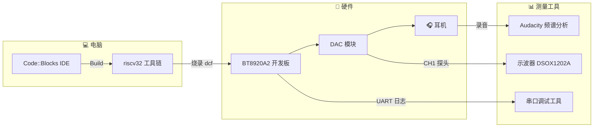
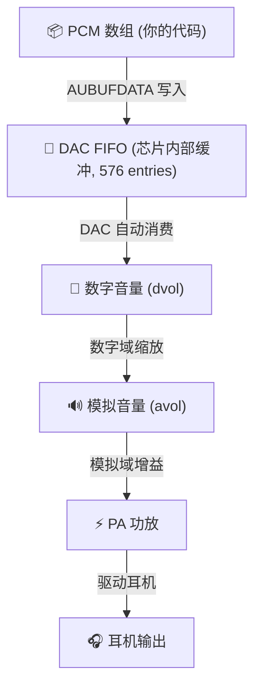
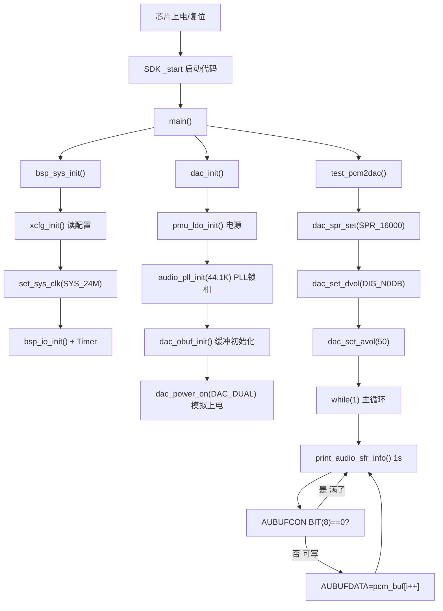
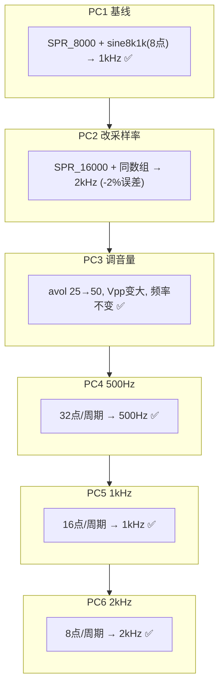

# A1 任务教学：DAC 输出 500/1k/2k Hz 正弦波（零基础小白版）

> **适用对象**：第一次接触嵌入式音频开发的同学，还没做过任何 DAC 实验。
> **目标**：理解 DAC 工作原理，掌握"用代码生成正弦波 → 从耳机听到声音 → 用示波器验证频率"的完整流程。
> **配套工程**：[`app/`](../../app/)；详细参考 [`SDK入门与任务实施指南.md`](SDK入门与任务实施指南.md) 第 21~24 章。
> **前提**：电脑已安装 Code::Blocks 与 `riscv32` 工具链，能够成功 Build 本工程并烧录到 BT8920A2 开发板。

---

## 第 0 节 · A1 任务在做什么？

**一句话**：在代码里写一个"正弦波数组"，芯片循环读取数组里的数字，DAC 把它变成模拟电压，耳机就能听到固定频率的声音。

```text
你的代码                      BT8920A2 芯片               你的耳朵
┌──────────────┐            ┌─────────────────┐         ┌──────┐
│ PCM 数组      │  ──写──►  │ DAC FIFO        │         │      │
│ [0x0000,     │            │  (数据缓冲队列)   │──消费──►│ 🎧   │
│  0x2D5C,     │            │       ↓          │         │      │
│  0x4027, ...]│            │  DAC 数字→模拟    │         └──────┘
│              │            │       ↓          │            ↑
│  16kHz 循环写 │            │  模拟电压输出 → 耳机   听到 1kHz 正弦
└──────────────┘            └─────────────────┘
```



**核心公式**（贯穿整个 A1 任务）：

```text
输出频率 f = 采样率 fs / 每周期样点数 N

例如：
  16 kHz / 32 点 = 500 Hz   （低音）
  16 kHz / 16 点 = 1000 Hz  （中音）
  16 kHz / 8 点  = 2000 Hz  （高音）
```

---

## 第 1 节 · 要先理解什么是 DAC

### 1.1 DAC = 数字到模拟的翻译器

DAC（Digital-to-Analog Converter）的本质是：**把一串数字变成连续的电压波形**。

```text
数字世界（你的代码）              模拟世界（物理电信号）
┌─────────────────┐             ┌─────────────────┐
│ 0x0000, 0x2D5C, │    DAC     │  ~~~~  ~~~~     │
│ 0x4027, 0x2D5C, │  ═══════►  │ /    \/    \    │
│ 0x0000, ...      │   转换     │/              \  │
└─────────────────┘             └─────────────────┘
  PCM 数据 (整数)                电压波形 (连续)
```

- 数字 `0x0000` → 电压 0V（静止）
- 数字 `0x4027`（+16423）→ 正向峰值电压
- 数字 `0xBFD9`（-16423）→ 负向峰值电压
- 每秒输出 N 个数字 → 波形就每秒重复 N/周期点数 次

### 1.2 DAC 的关键部分



| 部件 | 寄存器 | 做什么 | A1 怎么用 |
|------|--------|--------|----------|
| **DAC FIFO** | `AUBUFCON`, `AUBUFDATA` | 缓冲待播放的数据 | 循环写入 PCM 数据 |
| **采样率** | `DACDIGCON0[5:2]` | 每秒播放多少个样点 | `dac_spr_set(SPR_16000)` |
| **数字音量** | `DACVOLCON` | 数字域缩放幅度 | `dac_set_dvol(DIG_N0DB)` 最大 |
| **模拟音量** | `AUANGCON3[6:0]` | 模拟域真实放大 | `dac_set_avol(50)` = -4dB |
| **PA 功放** | `AUANGCON0~3` | 驱动耳机 | 初始化时自动配置 |

### 1.3 DAC FIFO = 餐厅的"出餐口"

想象一个餐厅：

```text
厨师 (你的代码)          出餐口 (FIFO)          服务员 (DAC硬件)
   │                        │                        │
   ├─ 做菜1 ──►           [1]                      │
   ├─ 做菜2 ──►         [2][1]                     │
   ├─ 做菜3 ──►       [3][2][1]                   │
   │                   [3][2]     ──► 端走1         │
   │                   [3]        ──► 端走2         │
   │                   满了!                        │
   ├─ 等待...          [满]       ──► 端走3         │
   ├─ 做菜4 ──►         [4]        ──► ...循环      │
```

- **FIFO 满了** (`AUBUFCON & BIT(8)` = 1) → 厨师暂停，等服务员腾出空位
- **FIFO 空了** → 服务员没菜可端 → **声音断掉**（听到噼啪声）
- **理想状态** → 厨师和服务员速度匹配，FIFO 在 50%~90% 之间波动

代码体现：

```c
while(1) {
    if ((AUBUFCON & BIT(8)) == 0) {  // FIFO 没满？→ 赶紧放数据
        AUBUFDATA = pcm_buf[i++];    // 写入一个 32-bit 立体声样点
    }
    // 满了就跳过，等下一个循环再试
}
```

### 1.4 采样率是什么

```text
采样率 fs = 每秒播放多少个 PCM 样点

fs = 8000  → 每秒 8000 个样点 → 最大能表示的频率 = 4000 Hz
fs = 16000 → 每秒 16000 个样点 → 最大能表示的频率 = 8000 Hz
fs = 44100 → 每秒 44100 个样点 → CD 音质标准
```

采样率决定了你的正弦波数组**被播放的速度**：

```text
数组 [A, B, C, D, E, F, G, H]  共 8 个样点/周期

@ 8 kHz  → 每点间隔 125µs → 1 周期=1ms → f=1000 Hz
@ 16 kHz → 每点间隔 62.5µs → 1 周期=0.5ms → f=2000 Hz
```

**同一张数组，采样率翻倍 → 频率翻倍。**

### 1.5 立体声数据格式

BT8920A2 的 DAC FIFO 是 32-bit 的：

```text
AUBUFDATA (32-bit)
┌────────────────────┬────────────────────┐
│   高 16-bit: 右声道  │   低 16-bit: 左声道  │
│   (Right Channel)   │   (Left Channel)    │
└────────────────────┴────────────────────┘

在本项目的正弦表里，左右声道数据相同（都输出一样的正弦波）：
  左声道 = 右声道 = 同一个 16-bit 值

AUBUFDATA = (right << 16) | left
          = (value << 16) | value    ← 同一声道数据重复
```

---

## 第 2 节 · 正弦波数组是怎么做的

### 2.1 正弦波 = sin 函数采样

```text
连续正弦波:        ~~~~~~~~
                     ↓  每隔 360°/N 取样
离散样点:          • • • • • • • •

每个样点的值 = sin(2π × n / N) × 幅度
n = 0, 1, 2, ..., N-1
```

### 2.2 具体例子：8 点/周期

```text
n=0:  sin(0°)     =  0.000 → 0x0000
n=1:  sin(45°)    =  0.707 → 0x2D5C  (≈11580)
n=2:  sin(90°)    =  1.000 → 0x4027  (≈16423, 正向峰值)
n=3:  sin(135°)   =  0.707 → 0x2D5C
n=4:  sin(180°)   =  0.000 → 0x0000
n=5:  sin(225°)   = -0.707 → 0xD2A4  (≈-11580)
n=6:  sin(270°)   = -1.000 → 0xBFD9  (≈-16423, 负向峰值)
n=7:  sin(315°)   = -0.707 → 0xD2A4

数组排列 (小端序, 16-bit 立体声): 
  左声道低字节, 左声道高字节, 右声道低字节, 右声道高字节
```

### 2.3 实际代码中的数组

```c
// 8 kHz 采样率 + 8 点/周期 = 1000 Hz
unsigned char sine8k1k[32] = {
    // L0     R0       L1     R1       L2     R2       L3     R3
    0x00,0x00, 0x00,0x00, 0x5C,0x2D, 0x5C,0x2D, 0x27,0x40, 0x27,0x40, 0x5C,0x2D, 0x5C,0x2D,
    // L4     R4       L5     R5       L6     R6       L7     R7
    0x00,0x00, 0x00,0x00, 0xA4,0xD2, 0xA4,0xD2, 0xD9,0xBF, 0xD9,0xBF, 0xA4,0xD2, 0xA4,0xD2,
};
// 解读: sine8k1k[0..1] = L0=0x0000 → 左声道样点=0
//       sine8k1k[4..5] = L1=0x2D5C → 左声道样点=11580
//       32 bytes = 8 pairs × 4 bytes/pair
```

### 2.4 三种频率的数组对比

| 频率 | 每周期点数 | 数组字节数 | 波形特征 |
|------|-----------|-----------|---------|
| **500 Hz** | 32 点 | 128 bytes | 最平滑，样点间隔最小 |
| **1000 Hz** | 16 点 | 64 bytes | 适中 |
| **2000 Hz** | 8 点 | 32 bytes | 最稀疏，但人耳听不出区别 |

```text
500 Hz (32 点/周期):  ••••••••••••••••••••••••••••••••  最密
1 kHz (16 点/周期):   •  •  •  •  •  •  •  •  •  •  •  适中
2 kHz (8 点/周期):    •    •    •    •    •    •    •   最稀
```

---

## 第 3 节 · 完整代码解读

### 3.1 入口：main.c 如何调用 A1

```c
// app/projects/standard/main.c
int main(void)
{
    bsp_sys_init();    // ① 系统时钟、IO、串口初始化
    dac_init();         // ② DAC 上电、PLL、缓冲初始化

    switch (xcfg_cb.test_mode) {
    case TEST_PCM2DAC:           // test_mode = 0
        test_pcm2dac();          // ③ 进入 A1 测试
        break;
    }
    WDT_DIS(); while(1);
}
```

### 3.2 核心函数：test_pcm2dac()

```c
// app/platform/bsp/bsp_sys.c

// ==== 编译时切换频率 ====
#ifndef A1_CUR_FREQ
#define A1_CUR_FREQ    0     // 0=500Hz, 1=1kHz, 2=2kHz
#endif

#if (A1_CUR_FREQ == 0)
#define A1_SINE_TABLE      sine_16k_500hz
#define A1_SINE_TABLE_SIZE sizeof(sine_16k_500hz)
#elif (A1_CUR_FREQ == 1)
#define A1_SINE_TABLE      sine_16k_1khz
#define A1_SINE_TABLE_SIZE sizeof(sine_16k_1khz)
#elif (A1_CUR_FREQ == 2)
#define A1_SINE_TABLE      sine_16k_2khz
#define A1_SINE_TABLE_SIZE sizeof(sine_16k_2khz)
#endif

void test_pcm2dac(void)
{
    WDT_DIS();                          // 关看门狗

    // ==== ① 设置 DAC 参数 ====
    dac_spr_set(SPR_16000);             // 采样率 = 16 kHz
    dac_set_dvol(DIG_N0DB);             // 数字音量 = 最大 (0 dB)
    dac_set_avol(50);                   // 模拟音量 = N_4DB (-4 dB)

    // ==== ② 指向要播放的正弦表 ====
    u32 *pcm_buf = (u32*)A1_SINE_TABLE;
    u32 i = 0;

    // ==== ③ 主循环：不停往 FIFO 填数据 ====
    while(1) {
        print_audio_sfr_info();         // 每 1 秒打印一次寄存器状态

        if ((AUBUFCON & BIT(8)) == 0) { // FIFO 没满？
            AUBUFDATA = pcm_buf[i];     //   写入一个样点
            pcm_cnt++;                  //   计数 (用来算 SampleRate)
            i++;
            if (i >= A1_SINE_TABLE_SIZE/4) {  // 数组放完 → 从头循环
                i = 0;
            }
        }
        // FIFO 满了就跳过，等下一轮 (DAC 硬件自己消费)
    }
}
```

### 3.3 三个关键 API

```c
// 1. 设置采样率 — 改变音调
void dac_spr_set(uint spr)
{
    DACDIGCON0 &= ~0x3C;        // 清除 [5:2] 这 4 位
    DACDIGCON0 |= (spr << 2);   // 写入新的采样率编码
}
// SPR_8000=9, SPR_16000=6, SPR_44100=1, SPR_48000=0

// 2. 设置数字音量 — 缩放数字值
void dac_set_dvol(u16 vol)
{
    DACVOLCON = vol | (0x02 << 16);
}
// DIG_N0DB=32767 (最大), DIG_N60DB=0 (最小)

// 3. 设置模拟音量 — 真实改变电压幅度
void dac_set_avol(u16 vol_idx)
{
    if (vol_idx >= 59) vol_idx = 59;      // 上限保护
    AUANGCON3 = (AUANGCON3 & ~0x7f)       // 清除旧的
              | tbl_dac_avol_gain[vol_idx]; // 查表写入
}
// vol_idx: 0(N_54DB,-54dB) ~ 53(N_1DB,-1dB) ~ 59(P_5DB,+5dB)
```

### 3.4 完整调用链



---

## 第 4 节 · PC（增量测试）步骤

每个 PC 只改一个变量，验证后再下一步。



### PC1（基线）— 8 kHz + 1 kHz 数组

**目的**：确认整个链路能跑通。

| 项目 | 值 |
|------|-----|
| `dac_spr_set` | `SPR_8000` |
| 正弦表 | `sine8k1k`（8 点/周期）|
| 理论频率 | 8000 / 8 = **1000 Hz** |
| 实测频率 | **1.000 kHz** ✅ |
| 串口 `DACDIGCON0` | `0x225` |

**验证**：链路通畅，编译/烧录/串口/声音/示波器全部 OK。

### PC2 — 改采样率到 16 kHz

**改动**：仅改 1 行 `SPR_8000` → `SPR_16000`

| 项目 | PC1 | PC2 |
|------|-----|-----|
| 采样率 | 8 kHz | **16 kHz** |
| 数组 | sine8k1k (8点) | 不变 |
| 理论频率 | 1000 Hz | **2000 Hz** |
| 实测频率 | 1000 Hz | **1959.8 Hz** (-2%) |
| `DACDIGCON0` | 0x225 | **0x219** |

**-2% 误差原因**：DAC 内部 SRC 把 16k 输入转 44.1k 输出时比例不完全精确，属正常现象。

### PC3 — 调大模拟音量

**改动**：`dac_set_avol(25)` → `dac_set_avol(50)`

| 项目 | PC2 | PC3 |
|------|-----|-----|
| avol | 25 (N_29DB, -29dB) | **50 (N_4DB, -4dB)** |
| 频率 | 1959.8 Hz | **1959.8 Hz（不变）** |
| Vpp | 790 mV | **大幅增加（约 2.2V）** |
| 声音 | 一般 | **明显更响** |

**核心发现**：频率和音量**完全独立**，改 avol 只改 Vpp，不改频率。

### PC4 — 替换为 500 Hz 数组

**改动**：换 `sine_16k_500hz`（32 点/周期）

| 项目 | PC3 | PC4 |
|------|-----|-----|
| 数组 | sine8k1k (8点) | **sine_16k_500hz (32点)** |
| 理论频率 | 2000 Hz | **500 Hz** |
| 声音 | 中高音 | **明显低沉** |

验证 `f = fs / N` 公式：32 点 → 频率减为 1/4。

### PC5 — 替换为 1 kHz 数组

**改动**：`#define A1_CUR_FREQ 1` → 自动选 `sine_16k_1khz`（16 点）

| 项目 | PC4 | PC5 |
|------|-----|-----|
| 理论频率 | 500 Hz | **1000 Hz** |
| 实测频率 | ~490 Hz | **~980 Hz** |

### PC6 — 替换为 2 kHz 数组

**改动**：`#define A1_CUR_FREQ 2` → 自动选 `sine_16k_2khz`（8 点）

| 项目 | PC5 | PC6 |
|------|-----|-----|
| 理论频率 | 1000 Hz | **2000 Hz** |
| 实测频率 | ~980 Hz | **~1960 Hz** |

**A1 任务完成** ✅ — 三种频率全部验证通过。

---

## 第 5 节 · 模拟音量对照表

| avol 索引 | 编码 | dB | 声音感受 |
|----------:|------|-----|---------|
| 0 | N_54DB | -54 | 几乎听不到 |
| 25 | N_29DB | -29 | 一般 (PC1/PC2) |
| 40 | N_14DB | -14 | 比较响 |
| **50** | **N_4DB** | **-4** | **很大 (PC3~PC6)** |
| 53 | N_1DB | -1 | 接近上限 |
| 54 | N_0DB | 0 | 临界 |
| 55 | P_1DB | +1 | 可能削顶 |
| 59 | P_5DB | +5 | 必削顶 |

---

## 第 6 节 · 关键寄存器速查

### 6.1 DACDIGCON0 — DAC 数字控制

| 位 | 含义 | PC2 值时 |
|----|------|---------|
| BIT(0) | DAC 数字使能 | 1 |
| BIT(1) | 0=44.1K 域, 1=48K 域 | 0 |
| [5:2] | SRC 输入采样率 | SPR_16000=6 (`0b0110`) |
| BIT(9) | 去 DC 偏置 | 1 |

`DACDIGCON0 = 0x219` = `0b 0010 0001 1001`

### 6.2 AUANGCON3 — 模拟音量

| 位 | 含义 | PC3 值时 |
|----|------|---------|
| [6:0] | 模拟增益编码 | `0x02` = N_4DB |

### 6.3 AUBUFCON — DAC 缓冲控制

| 位 | 含义 |
|----|------|
| BIT(0) | FIFO Reset (1=冻结, 0=运行) |
| BIT(8) | FIFO Full (1=满 不可写, 0=未满 可写) |
| BIT(18) | High sample rate count enable |

### 6.4 AUBUFDATA — DAC 数据写入

```c
// 写入格式：右声道高 16-bit + 左声道低 16-bit
AUBUFDATA = ((u32)right_sample << 16) | (u32)left_sample;
```

---

## 第 7 节 · 完整代码汇总

```c
// ====================
// app/platform/bsp/bsp_sys.c
// ====================

// ---- 正弦表 (16 kHz 采样率) ----

// 500 Hz: 32 点/周期, 128 bytes
unsigned char sine_16k_500hz[128] = {
    0x00,0x00,0x00,0x00, 0x84,0x0C,0x84,0x0C, 0x8D,0x18,0x8D,0x18, 0xA4,0x23,0xA4,0x23,
    0x5D,0x2D,0x5D,0x2D, 0x57,0x35,0x57,0x35, 0x45,0x3B,0x45,0x3B, 0xEB,0x3E,0xEB,0x3E,
    0x27,0x40,0x27,0x40, 0xEB,0x3E,0xEB,0x3E, 0x45,0x3B,0x45,0x3B, 0x57,0x35,0x57,0x35,
    0x5D,0x2D,0x5D,0x2D, 0xA4,0x23,0xA4,0x23, 0x8D,0x18,0x8D,0x18, 0x84,0x0C,0x84,0x0C,
    0x00,0x00,0x00,0x00, 0x7C,0xF3,0x7C,0xF3, 0x73,0xE7,0x73,0xE7, 0x5C,0xDC,0x5C,0xDC,
    0xA3,0xD2,0xA3,0xD2, 0xA9,0xCA,0xA9,0xCA, 0xBB,0xC4,0xBB,0xC4, 0x15,0xC1,0x15,0xC1,
    0xD9,0xBF,0xD9,0xBF, 0x15,0xC1,0x15,0xC1, 0xBB,0xC4,0xBB,0xC4, 0xA9,0xCA,0xA9,0xCA,
    0xA3,0xD2,0xA3,0xD2, 0x5C,0xDC,0x5C,0xDC, 0x73,0xE7,0x73,0xE7, 0x7C,0xF3,0x7C,0xF3,
};

// 1 kHz: 16 点/周期, 64 bytes
unsigned char sine_16k_1khz[64] = {
    0x00,0x00,0x00,0x00, 0x8D,0x18,0x8D,0x18,
    0x5D,0x2D,0x5D,0x2D, 0x45,0x3B,0x45,0x3B,
    0x27,0x40,0x27,0x40, 0x45,0x3B,0x45,0x3B,
    0x5D,0x2D,0x5D,0x2D, 0x8D,0x18,0x8D,0x18,
    0x00,0x00,0x00,0x00, 0x73,0xE7,0x73,0xE7,
    0xA3,0xD2,0xA3,0xD2, 0xBB,0xC4,0xBB,0xC4,
    0xD9,0xBF,0xD9,0xBF, 0xBB,0xC4,0xBB,0xC4,
    0xA3,0xD2,0xA3,0xD2, 0x73,0xE7,0x73,0xE7,
};

// 2 kHz: 8 点/周期, 32 bytes
unsigned char sine_16k_2khz[32] = {
    0x00,0x00,0x00,0x00, 0x5D,0x2D,0x5D,0x2D,
    0x27,0x40,0x27,0x40, 0x5D,0x2D,0x5D,0x2D,
    0x00,0x00,0x00,0x00, 0xA3,0xD2,0xA3,0xD2,
    0xD9,0xBF,0xD9,0xBF, 0xA3,0xD2,0xA3,0xD2,
};

// ---- 编译时切换 ----
#ifndef A1_CUR_FREQ
#define A1_CUR_FREQ    0
#endif

#if   (A1_CUR_FREQ == 0)
#define A1_SINE_TABLE      sine_16k_500hz
#define A1_SINE_TABLE_SIZE sizeof(sine_16k_500hz)
#elif (A1_CUR_FREQ == 1)
#define A1_SINE_TABLE      sine_16k_1khz
#define A1_SINE_TABLE_SIZE sizeof(sine_16k_1khz)
#elif (A1_CUR_FREQ == 2)
#define A1_SINE_TABLE      sine_16k_2khz
#define A1_SINE_TABLE_SIZE sizeof(sine_16k_2khz)
#endif

// ---- 主函数 ----
void test_pcm2dac(void)
{
    WDT_DIS();
    dac_spr_set(SPR_16000);               // 采样率 16 kHz
    dac_set_dvol(DIG_N0DB);               // 数字音量 0 dB
    dac_set_avol(50);                     // 模拟音量 -4 dB
    u32 *pcm_buf = (u32*)A1_SINE_TABLE;
    u32 i = 0;

    while(1) {
        print_audio_sfr_info();           // 每秒打印状态
        if ((AUBUFCON & BIT(8)) == 0) {
            AUBUFDATA = pcm_buf[i++];
            if (i >= A1_SINE_TABLE_SIZE / 4) i = 0;
        }
    }
}
```

---

## 第 8 节 · 测试方法

### 8.1 物理接线

```text
开发板耳机座 → 耳机

示波器：
  CH1 探头 → DAC 输出脚 (或用耳机线引出)
  地线夹 → 开发板 GND
  AC 耦合, 10:1 探头
```

### 8.2 切换频率

```text
1. 打开 app/platform/bsp/bsp_sys.c
2. 找到 #define A1_CUR_FREQ 0
3. 改成 0 (500Hz) / 1 (1kHz) / 2 (2kHz)
4. 重新 Build → 烧录
5. 示波器验证频率
```

### 8.3 示波器操作步骤

```text
1. 按 Default Setup 恢复出厂
2. 按数字键 1 打开 CH1
3. F2 → Probe → 10:1
4. F3 → Coupling → AC
5. 探头接 DAC 输出 + GND
6. 按 Auto Scale 自动调档
7. 按 Meas → Freq → Add Meas
8. 读取频率值
```

### 8.4 验收标准

| 项目 | 标准 |
|------|------|
| 示波器频率 | 500/980/1960 Hz (含 -2% 系统误差) |
| 频率稳定性 | 不跳变 (标准偏差 ≈ 0 Hz) |
| 耳机 | 听到对应音调，无断续 |
| 串口 `SampleRate` | ≈ 16000 |
| 串口 `DACDIGCON0` | = 0x219 |
| 串口 `FIFO` | 在 50%~90% 区间波动 |

---

## 第 9 节 · 常见故障排查

| 现象 | 可能的原因 | 解决 |
|------|-----------|------|
| **完全没声音** | DAC 没初始化 / 数组指针空 | 检查串口日志是否有 `dac_init, ldoh=3` |
| **频率是理论值的 2 倍** | 用了 8k 数组在 16k 采样率下 | 换成对应频率的数组 |
| **频率是理论值的一半** | 用了 16k 数组在 8k 采样率下 | 检查 `dac_spr_set()` 参数 |
| **声音断续/噼啪** | FIFO 供数不足 | 检查主循环是否有耗时操作 |
| **顶部削平** | 音量过大 (avol >= 55) | 降低 avol 到 50 左右 |
| **频率跳变** | SRC 引入延迟 | 保持采样率稳定 |
| **串口无输出** | UART 线接错或波特率不对 | 检查 TX/RX/GND、波特率 |
| **示波器无波形** | 探头接触不良 / 通道没开 | Default Setup → Auto Scale 重试 |

---

## 第 10 节 · 课后练习

完成 A1 后建议做这些练习（每题 10 分钟）：

1. **改 dvol**：把 `DIG_N0DB` 改成 `DIG_N6DB`（-6 dB），看 Vpp 是否减半
2. **改 avol**：分别试 avol=30 / 40 / 50 / 53，看示波器 Vpp 变化
3. **自定义频率**：用 Python 生成 12 点/周期的 1333 Hz 自定义数组
4. **示波器时基**：把时基调到 100 ms/div，看波形是否长时间稳定
5. **Audacity 录音**：录下 DAC 输出，看频谱主峰是否在目标频率

---

## 第 11 节 · A1 → A2 预告

A1 完成后，下一个任务是 **A2：AUX ADC → DAC**：

```text
A1:  固定 PCM 数组 → DAC → 耳机          (你已经完成的)
A2:  AUX 模拟输入 → ADC → DMA → DAC → 耳机 (下一步要做的)
```

A2 需要：
- 把电脑音频通过 **AUX 线** 输入到开发板
- 芯片内部的 **SDADC** 采样模拟信号
- **DMA** 自动搬运数据到内存
- **中断 ISR** 里把数据推到 DAC FIFO
- 用 **GCC `--wrap`** 链接器选项覆盖库函数

详见 [A2任务降噪调优教学.md](A2任务降噪调优教学.md)。

---

```mermaid
mindmap
  root((A1 DAC正弦波))
    DAC工作原理
      数字→模拟转换
      FIFO缓冲队列
      采样率决定播放速度
      立体声左右16bit
    核心公式
      f=fs/N
      16kHz÷32点=500Hz
      16kHz÷16点=1000Hz
      16kHz÷8点=2000Hz
    三个关键API
      dac_spr_set 采样率
      dac_set_dvol 数字音量
      dac_set_avol 模拟音量
    正弦表生成
      sin(2πn/N)×幅度
      u8数组小端序
      左右声道重复
    6次增量测试
      PC1 8k+8点=1kHz基线
      PC2 改16kHz翻倍
      PC3 调avol音量大
      PC4 32点500Hz
      PC5 16点1kHz
      PC6 8点2kHz完成
    测试验证
      示波器测频率
      串口看SampleRate
      Audacity频谱分析
      耳机听音调
```

---

> **文档版本**：v1.0
> **编写日期**：2026-07-30
> **配套代码**：[`app/platform/bsp/bsp_sys.c`](../../app/platform/bsp/bsp_sys.c) — `test_pcm2dac()`

**A1 教学结束。** 如果你能从第 0 节读到这里，理解每个 PC 的目的和结果，就具备了继续做 A2 的基础。
