# BT8920A2 音频开发完全入门指南（从零到 IIS 双板联调）

> **适用对象**：第一次接触嵌入式音频开发、BT8920A2 芯片、RISC-V、DAC/IIS 这些词汇的同学。
> **目标**：读完本文后，你能理解整个工程的架构、音频数据如何流动、每个任务在做什么、并能独立完成 A1~A4 四个实验。
> **配套工程**：[`app/`](../app/)；完整文档目录见 [§17 文档索引](#17-文档索引)。
> **阅读建议**：本文是"总地图"——先通读一遍建立全局概念，做具体任务时再精读对应的分文档。

---

## 目录

1. [工程全景：从电脑到耳机](#1-工程全景从电脑到耳机)
2. [开发环境与工具](#2-开发环境与工具)
3. [DAC：数字到模拟的桥梁](#3-dac数字到模拟的桥梁)
4. [PCM：音频在代码里的样子](#4-pcm音频在代码里的样子)
5. [ADC/SDADC：模拟到数字的桥梁](#5-adcsdadc模拟到数字的桥梁)
6. [DMA：让硬件自动搬数据](#6-dma让硬件自动搬数据)
7. [中断 ISR：DMA 完成后的回调](#7-中断-isrdma-完成后的回调)
8. [IIS/I²S：芯片间的数字音频高速公路](#8-iisi²s芯片间的数字音频高速公路)
9. [PLL 与时钟系统](#9-pll-与时钟系统)
10. [音量控制：数字音量 vs 模拟音量](#10-音量控制数字音量-vs-模拟音量)
11. [GCC --wrap：如何覆盖库函数](#11-gcc---wrap如何覆盖库函数)
12. [内存与链接脚本](#12-内存与链接脚本)
13. [四个任务全览 (A1→A4)](#13-四个任务全览-a1a4)
14. [任务 A1：PCM → DAC 正弦波](#14-任务-a1pcm--dac-正弦波)
15. [任务 A2：AUX ADC → DAC 实时直通](#15-任务-a2aux-adc--dac-实时直通)
16. [任务 A3+A4：IIS 双板联调](#16-任务-a3a4iis-双板联调)
17. [文档索引](#17-文档索引)
18. [学习路线图](#18-学习路线图)

---

## 1. 工程全景：从电脑到耳机

### 1.1 五层模型

把这个工程想象成一座 5 层大楼，数据从顶层流到底层：

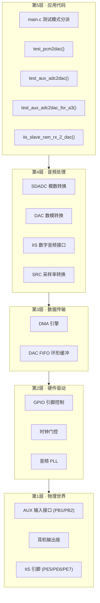

### 1.2 四大数据流路径

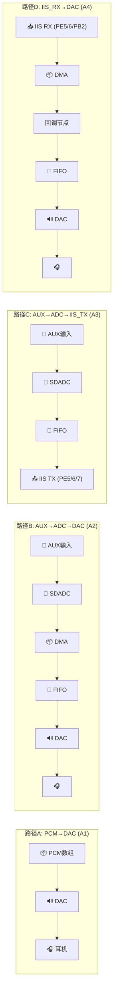

| 路径 | 任务 | 数据流方向 | 关键知识点 |
|------|------|-----------|-----------|
| A | A1 | 代码数组 → DAC → 耳机 | DAC 基础、采样率、正弦表 |
| B | A2 | AUX → ADC → DMA → ISR → DAC | ADC、DMA、中断、FIFO |
| C | A3 | AUX → ADC → DAC + IIS 同时输出 | IIS Master、SRCTX、引脚复用 |
| D | A4 | IIS 输入 → DMA → ISR → DAC | IIS Slave、DMA RX、回调 |

### 1.3 完整硬件连接图

```text
                            BT8920A2 开发板
                    ┌─────────────────────────────────┐
    电脑音频输出     │                                 │
   ┌──────────┐     │  PB1◄── AUX-L (左声道模拟输入)    │
   │ 3.5mm AUX├─────┼──┤                               │
   │ 插头      │     │  PB2◄── AUX-R (右声道模拟输入)    │
   └──────────┘     │                                 │
                    │  PE5 ──► IIS BCLK 输出 (主机)     ├──► 板B 或 逻辑分析仪
   USB-TTL 串口     │  PE6 ──► IIS LRC 输出  (主机)     │
   ┌──────────┐     │  PE7 ──► IIS DO 输出   (主机)     │
   │ TX ◄──────────┼── PB3 (UART TX, 串口日志)         │
   │ RX ──────────►├── PB2 (UART RX)                   │
   │ GND ════════════ GND                              │
   └──────────┘     │                                 │
                    │  耳机座 ◄── DAC 模拟输出 (双声道)   │
   示波器           │    │                             │
   ┌──────────┐     │    └── 🎧 耳机                    │
   │ CH1 ◄────┼─────┼── DAC 输出脚 (测波形)             │
   │ GND ════════════ GND                              │
   └──────────┘     └─────────────────────────────────┘
```

---

## 2. 开发环境与工具

### 2.1 工具链

| 工具 | 作用 | 你需要做什么 |
|------|------|-------------|
| **Code::Blocks** | IDE，管理工程和触发编译 | 打开 `app/projects/standard/app.cbp`，点 Build |
| **riscv32-elf-gcc** | RISC-V 交叉编译器 | Code::Blocks 自动调用，不需手动操作 |
| **riscv32-elf-xmaker** | 资源/配置打包工具 | prebuild.bat 自动调用 |
| **objcopy** | 生成 `.bin` 烧录文件 | postbuild.bat 自动调用 |
| **厂商下载器** | 把 `.dcf` 烧录到芯片 | 选择 `Output/bin/app.dcf`，点下载 |
| **USB-TTL 串口线** | 看 `printf` 日志输出 | 接 PB3(TX) + GND，波特率按默认 |
| **示波器 (DSOX1202A)** | 看波形、测频率/Vpp | CH1 探头接 DAC 输出，AC 耦合 10:1 |
| **逻辑分析仪 (LA1010)** | IIS 信号解码 | CH0=BCLK, CH1=LRC, CH2=DO, GND |
| **Audacity** | 录音 + 频谱分析 | 录 DAC 输出，看主峰频率 |

### 2.2 工程目录结构

```text
APP_8920A2_DAC_ADC_IIS_NEW_TEST/   ← 工程根目录
├── app/
│   ├── bsp_ext/                    ← ★ 你主要修改的目录 (应用层)
│   │   ├── bsp_dac_ext.c/h          DAC 驱动 (音量、采样率、初始化)
│   │   ├── bsp_adc_aux_ext.c/h      AUX SDADC 驱动 (ISR、DMA、增益)
│   │   ├── bsp_adc_pcm_to_dac_ext.c ★ ADC→DAC 数据搬运 (--wrap 重写)
│   │   ├── bsp_iis_ext.h            IIS 类型定义 (模式、IO、DMA)
│   │   ├── bsp_iis_master_ext.c     ★ IIS Master SRCTX (--wrap 重写)
│   │   ├── bsp_iis_slave_ext.c/h    ★ IIS Slave RAMRX (--wrap 重写)
│   │   └── audio_sfr.h              音频寄存器位域宏
│   ├── platform/                    ← 厂商 SDK (一般不改)
│   │   ├── header/                  寄存器地址(sfr.h)、类型、宏
│   │   ├── libs/                    预编译静态库(.a) + API头文件
│   │   └── bsp/                     基础 BSP (系统初始化等)
│   └── projects/standard/           ← 当前 Code::Blocks 工程
│       ├── main.c                   ★ 入口 + 测试模式分派
│       ├── config.h                 编译期配置 (时钟、DAC 输出采样率等)
│       ├── app.cbp                  Code::Blocks 工程文件 (含 --wrap 选项)
│       ├── ram.ld                   链接脚本 (内存分区、段映射)
│       └── Output/bin/              Build 产物 (dcf、bin、map 等)
└── docs/                            ← 文档
    ├── BT8920A2音频完全入门指南.md   ★ 本文 (你正在读的)
    ├── A1任务DAC正弦波教学.md        A1 详细教学
    ├── A2任务降噪调优教学.md         A2 详细教学 (含降噪)
    ├── A3任务IIS_MASTER_SRCTX教学.md A3 详细教学
    ├── A4任务IIS_SLAVE_RAMRX教学.md  A4 详细教学 (双板联调)
    ├── SDK入门与任务实施指南.md       综合技术参考
    ├── 噪音排查与修复指南.md          噪音问题诊断
    ├── I2S驱动资料.md               530X IIS 驱动示例 (参考)
    └── 待完成任务.md                 任务状态总览
```

### 2.3 Build → 烧录 → 验证 完整流程

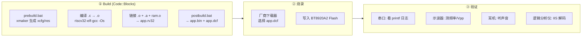

> ⚠️ **重要**：烧录的是 `app.dcf`（包含 app.bin + xcfg.bin + res.bin），不是单独的 `app.bin`。如果只烧 `app.bin`，`xcfg_cb.test_mode` 会读不到正确值。

---

## 3. DAC：数字到模拟的桥梁

### 3.1 什么是 DAC

**DAC = Digital-to-Analog Converter = 数模转换器**

```text
    数字世界 (离散)              模拟世界 (连续)
    ┌─────────────────┐         ┌─────────────────┐
    │ 0x0000 (0)      │         │                 │
    │ 0x2D5C (11580)  │  DAC   │   ~~~~  ~~~~    │
    │ 0x4027 (16423)  │ ════►  │  /    \/    \   │
    │ 0x2D5C (11580)  │ 转换   │ /              \ │
    │ 0x0000 (0)      │         │/                \│
    └─────────────────┘         └─────────────────┘
    每秒 N 个整数              连续的电压波形
```

核心概念：
- **每一个数字**对应一个**电压值**
- 数字**变化越快**→ 波形**频率越高**
- 数字**幅度越大**→ 波形**Vpp 越大**（声音越响）

### 3.2 DAC 内部结构

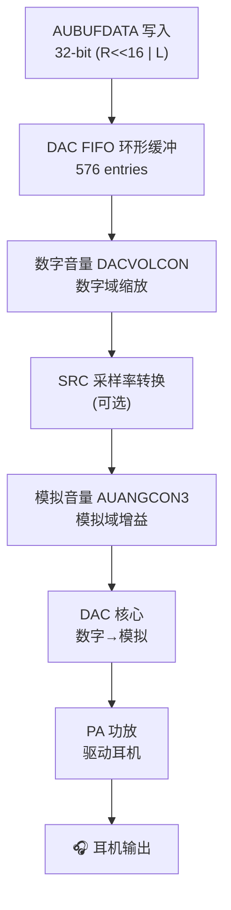

### 3.3 关键寄存器

| 寄存器 | 作用 | 如何读写 |
|--------|------|---------|
| `AUBUFCON` | FIFO 控制/状态 | BIT(0)=Reset, BIT(8)=Full flag |
| `AUBUFDATA` | **写入 PCM 数据** | 32-bit: `(R<<16) \| L` |
| `AUBUFSIZE` | FIFO 大小 + 阈值 | `(DAC_OBUF_SIZE-1) \| (threshold<<16)` |
| `AUBUFSTARTADDR` | FIFO 起始地址 | `DMA_ADR(dac_obuf)` |
| `AUBUFFIFOCNT` | 当前 FIFO 内数据量 | 只读，200~500 为正常 |
| `DACDIGCON0` | 数字控制 | BIT(0)=使能, [5:2]=采样率 |
| `DACVOLCON` | 数字音量 | `vol \| (0x02<<16)` |
| `AUANGCON3` | 模拟音量 | `[6:0]` = 模拟增益编码 |
| `PHASECOMP` | 相位补偿 | IIS 从机调速用 |

### 3.4 采样率 (Sample Rate)

```text
采样率 fs = 每秒播放多少个 PCM 样点

fs = 8000  → 每秒 8000 个点 → 最大能表示 4000 Hz
fs = 16000 → 每秒 16000 个点 → 电话音质
fs = 44100 → 每秒 44100 个点 → CD 音质
fs = 48000 → 每秒 48000 个点 → 专业音频

f_out = fs / N     (N = 每周期样点数)
N     = fs / f_out

例: 16kHz 下想要 500Hz → N = 16000/500 = 32 点/周期
```

### 3.5 数字音量 vs 模拟音量

| 特性 | 数字音量 `dac_set_dvol()` | 模拟音量 `dac_set_avol()` |
|------|--------------------------|--------------------------|
| 作用域 | 数字域（PCM 数值缩放） | 模拟域（真实电压增益） |
| 寄存器 | `DACVOLCON` | `AUANGCON3[6:0]` |
| 范围 | `DIG_N60DB` ~ `DIG_N0DB` | 0 (N_54DB) ~ 59 (P_5DB) |
| 对精度影响 | 降低幅度 → 损失精度 | 模拟放大 → 保持精度 |
| 推荐用法 | 保持最大 `DIG_N0DB` | **用这个来调音量** |

---

## 4. PCM：音频在代码里的样子

### 4.1 什么是 PCM

**PCM = Pulse Code Modulation = 脉冲编码调制**

就是把连续的模拟波形，按固定时间间隔取样，变成一串整数。

```text
模拟波形:      ~~~~  ~~~~  ~~~~
               ↓ 采样  ↓ 采样  ↓ 采样
PCM 数据:    [16423, 11580, 0, -11580, -16423, -11580, 0, 11580, ...]
               ↑ 16-bit 有符号整数
```

### 4.2 BT8920A2 的 PCM 格式

```text
DAC FIFO 接受 32-bit 数据:
┌──────────────────────┬──────────────────────┐
│   高 16-bit: 右声道    │   低 16-bit: 左声道    │
│   Right Channel       │   Left Channel        │
│   (16-bit signed)     │   (16-bit signed)     │
└──────────────────────┴──────────────────────┘

写入方法:
  AUBUFDATA = ((u32)right_sample << 16) | (u32)left_sample;

对于单声道/相同数据的立体声:
  AUBUFDATA = ((u32)sample << 16) | (u32)sample;
```

### 4.3 数组中的字节排列（小端序）

```c
// 一个立体声对 (L+R) 占 4 bytes
unsigned char sine[32] = {
    // L0_low, L0_high, R0_low, R0_high
    0x00, 0x00, 0x00, 0x00,   // pair[0] = 0x0000_0000
    0x5C, 0x2D, 0x5C, 0x2D,   // pair[1] = 0x2D5C_2D5C (左=右=11580)
    ...
};

// 读回:
u32 *pcm32 = (u32*)sine;
u32 pair0 = pcm32[0];  // = 0x00000000
u32 pair1 = pcm32[1];  // = 0x2D5C2D5C
```

### 4.4 如何生成正弦波数组

```python
# Python 脚本生成 C 数组
import math

fs = 16000      # 采样率
f  = 500        # 目标频率
N  = fs // f    # 每周期点数 = 32
amp = 16423     # 峰值 (0x4027, 约为满量程 32767 的一半)

pairs = []
for n in range(N):
    val = int(amp * math.sin(2 * math.pi * n / N))
    # 16-bit 有符号 → 低字节在前 (小端)
    lo = val & 0xFF
    hi = (val >> 8) & 0xFF
    # 左右声道相同
    pairs.append(f"0x{lo:02X}, 0x{hi:02X}, 0x{lo:02X}, 0x{hi:02X}")

print("unsigned char sine_16k_500hz[{}] = {{\n    {}\n}};".format(
    N * 4, ",\n    ".join(", ".join(pairs[i:i+4]) for i in range(0, len(pairs), 4))
))
```

---

## 5. ADC/SDADC：模拟到数字的桥梁

### 5.1 什么是 SDADC

**SDADC = Sigma-Delta ADC = Σ-Δ 模数转换器**

```text
    模拟世界 (连续)              数字世界 (离散)
    ┌─────────────────┐         ┌─────────────────┐
    │  ~~~~  ~~~~     │  SDADC │ 0x0000 (0)      │
    │ /    \/    \    │ ════►  │ 0x2D5C (11580)  │
    │/              \ │  采样  │ 0x4027 (16423)   │
    │                 │         │ 0x2D5C (11580)   │
    └─────────────────┘         └─────────────────┘
    模拟音频信号                16-bit 数字样点
```

SDADC 比普通 ADC 更适合音频，因为它对噪声的抑制更好（通过过采样 + 噪声整形）。

### 5.2 AUX 模拟通路

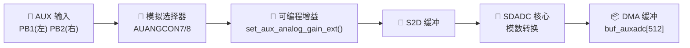

### 5.3 AUX 通道选择

BT8920A2 有多个 AUX 输入引脚可选：

| 声道 | 引脚 | 宏定义 | 通道码 | 寄存器位 |
|------|------|--------|--------|---------|
| 左 | PA6 | `CH_AUXL_PA6` | 0x01 | AUANGCON7 BIT(8) |
| 左 | **PB1** | `CH_AUXL_PB1` | **0x02** | AUANGCON7 BIT(9) |
| 左 | PE6 | `CH_AUXL_PE6` | 0x03 | AUANGCON7 BIT(10) |
| 左 | PF4 | `CH_AUXL_PF4` | 0x04 | AUANGCON7 BIT(11) |
| 右 | PA7 | `CH_AUXR_PA7` | 0x10 | AUANGCON8 BIT(8) |
| 右 | **PB2** | `CH_AUXR_PB2` | **0x20** | AUANGCON8 BIT(9) |
| 右 | PE7 | `CH_AUXR_PE7` | 0x30 | AUANGCON8 BIT(10) |
| 右 | PF5 | `CH_AUXR_PF5` | 0x40 | AUANGCON8 BIT(11) |

**本工程使用 PB1 + PB2**（`channel = 0x22`），因为 PE6/PE7 需要留给 IIS。

### 5.4 增益配置

```c
// gain 编码: 高 6-bit = 模拟增益 (0~23), 低 6-bit = 数字增益 (0~31)
auxadc_cb.gain = (analog_gain << 6) | digital_gain;

// 模拟增益表:
//   0: P6DB   1: P3DB   2: N0DB   3: N3DB   4: N6DB
//   5: N9DB   6: N15DB  7: N21DB  8: N27DB  9: N33DB  10: N39DB

// 数字增益: 0~31, 每步 3/32 dB ≈ 0.094 dB/步

// 本工程最佳值: analog_gain=8 (N27DB), digital_gain=15 (~-15dB)
// 总增益 ≈ -42dB, 给电脑音量留出足够余量, 避免削顶失真
```

---

## 6. DMA：让硬件自动搬数据

### 6.1 什么是 DMA

**DMA = Direct Memory Access = 直接内存访问**

```text
没有 DMA 时:                   有 DMA 时:
  CPU: 搬1 → 搬2 → 搬3 → ...     CPU: "DMA, 帮我搬 512 个, 地址是 XXX"
  (CPU 一直在忙搬数据)             DMA: 自动搬 1→2→3→...→512
                                   CPU: 干别的事去了 ✌️
```

### 6.2 SDADC 的 DMA 配置

```c
// 告诉 DMA: 从 SDADC 搬到 buf_auxadc, 共 512 个样点
SDADCLDMAADDR = DMA_ADR(buf_auxadc);    // 目标地址
SDADCLDMASIZE = samples - 1;            // 样点数 (DMASize + 1)
SDADCDMACON  |= 0x03;                   // 左+右 DMA 使能
SDADCDMACON  |= 0x30;                   // 使能半满 + 全满中断
```

### 6.3 DMA 循环缓冲

```text
DMA 循环写入 buf[0..511] (512 个立体声对):

  写入方向 →→→→→→→→→→→→→→→→→→→→→→→→→→
  ┌──────────────────────┬──────────────────────┐
  │  pairs[0..255]       │  pairs[256..511]     │
  │  前半 (256 对)        │  后半 (256 对)        │
  └──────────────────────┴──────────────────────┘

  T0: DMA 开始写 buf[0]
  T1: 写完前半 → BIT(1) Half Done 中断 → flag=1
      ✅ buf[0..255] 是新鲜数据
      ❌ buf[256..511] 是上一周期的旧数据!
  T2: 继续写后半
  T3: 写完后半 → BIT(0) Full Done 中断 → flag=0
      ✅ buf[256..511] 是新鲜数据
      ❌ buf[0..255] 正被下一周期 DMA 覆盖!
  T4: 回绕到 buf[0], 开始下一周期
```

> ⚠️ **最常见的噪音 bug**：在 `flag=1` 时读了 `buf[256..511]`（旧数据），或在 `flag=0` 时读了 `buf[0..255]`（被覆盖中），导致混入 50% 垃圾数据。

### 6.4 IIS RX DMA（A4 任务）

```c
// IIS 接收端的 DMA 配置
cfg->dma_cfg.samples            = 64;           // 每次 DMA 64 个样点
cfg->dma_cfg.dmabuf_len         = 2048;         // 缓冲区 2048 字节
cfg->dma_cfg.dmabuf_ptr         = iis_dmabuf1;  // 库内 bram 缓冲
cfg->dma_cfg.iis_isr_rx_callbck = iis_rx_process_test; // 完成回调
```

IIS DMA 也是双缓冲：收到一半触发一次回调，收完触发第二次。

---

## 7. 中断 ISR：DMA 完成后的回调

### 7.1 什么是中断

```text
主程序: 做菜...做菜...做菜...做菜...做菜...
                          ↑
                     [叮! DMA 搬完了!]
                          ↑
中断 → 暂停主程序 → 执行 ISR (处理数据) → 返回主程序继续做菜
```

### 7.2 SDADC 中断处理流程

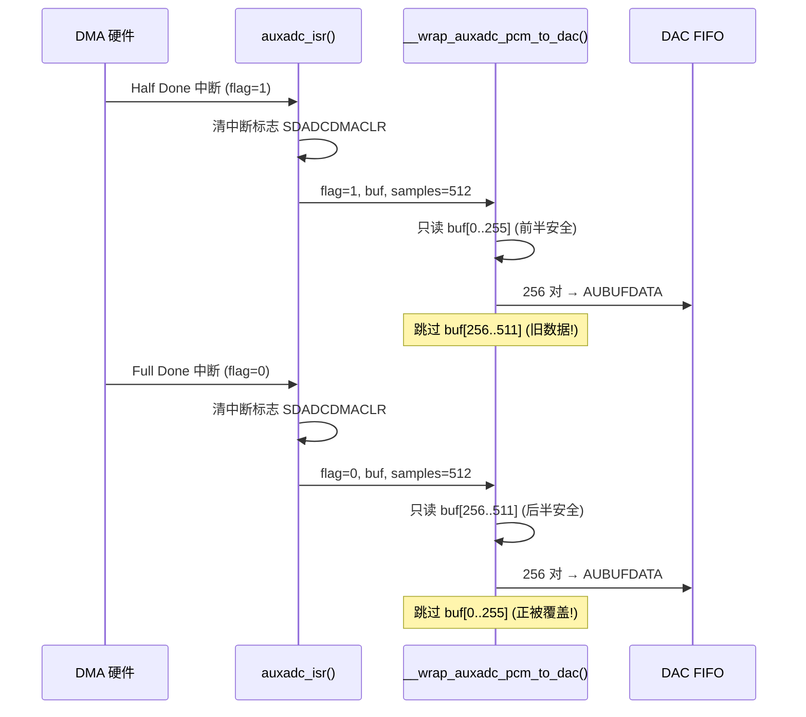

### 7.3 ISR 中不能做的事

```text
❌ 大量 printf (串口慢, 会阻塞)
❌ 复杂循环 (几十毫秒的运算)
❌ delay_ms() / delay_us() (死等)
❌ 文件操作 / 网络请求
❌ 调用可能阻塞的库函数

✅ 指针操作 / 数组索引
✅ 读寄存器、写寄存器
✅ 简单的数据搬运 (几百个样点)
✅ 标志位设置
✅ 每秒限流 1 次的 printf 诊断 (调试用, 正式版关闭)
```

---

## 8. IIS/I²S：芯片间的数字音频高速公路

### 8.1 什么是 IIS

**IIS = Inter-IC Sound = I²S = 芯片间数字音频传输协议**

```text
        主机 (Master)                          从机 (Slave)
    ┌──────────────────┐                  ┌──────────────────┐
    │ 产生 BCLK ─────────┼──── BCLK ──────┼──► 接收 BCLK      │
    │ 产生 LRC  ─────────┼──── LRC  ──────┼──► 接收 LRC       │
    │ 发送 DO  ──────────┼──── DO  ───────┼──► 接收 DI        │
    │ (可选) MCLK        │                │                  │
    └──────────────────┘                  └──────────────────┘
```

**三根核心信号线**：

| 信号 | 全称 | 作用 | 本工程引脚 |
|------|------|------|-----------|
| **BCLK** | Bit Clock | 每位数据一个时钟脉冲 | PE5 |
| **LRC** | Left-Right Clock (WS) | 低=左声道, 高=右声道 | PE6 |
| **DO/DI** | Data Out/Data In | 串行音频数据 | PE7(DO) / PB2(DI) |
| MCLK | Master Clock (可选) | 256fs 系统参考时钟 | PB1 (本工程禁用) |

### 8.2 IIS 时序

```text
             ┌───┐                                       ┌───┐
   LRC ──────┤   └───────────┐       ┌───────────────────┤   └──────
             │  LEFT CHANNEL │ RIGHT │                   │
             └──────────────┘ CHANNEL

                      ┌─┐ ┌─┐ ┌─┐ ┌─┐                  ┌─┐ ┌─┐ ┌─┐ ┌─┐
   BCLK ──────────────┘ └─┘ └─┘ └─┘ └─ ... ─────────────┘ └─┘ └─┘ └─┘

   DO   ────── MSB ─── ... ─── LSB ────── MSB ─── ... ─── LSB ──────
             │←  左声道 16-bit  →│       │←  右声道 16-bit  →│
```

### 8.3 时钟计算

```text
MCLK  = 参考时钟 / (mclk_div + 1)
BCLK  = MCLK / (bclk_div + 1)
LRC   = BCLK / (bit_width × 2)       ← 采样率

16-bit 时:
  BCLK = fs × 32   (每个声道 16 bit × 2 声道 = 32 BCLK/LRC 周期)
  MCLK = fs × 256  (256fs 模式)

例: 44.1kHz, 16-bit, 256fs:
  BCLK = 44.1k × 32 = 1.4112 MHz
  MCLK = 44.1k × 256 = 11.2896 MHz
```

### 8.4 BT8920A2 的 IO 映射

| 映射组 | MCLK | BCLK | LRC | DO | DI |
|--------|------|------|-----|----|----|
| **IIS_G2** (本工程使用) | PB1 | **PE5** | **PE6** | **PE7** | **PB2** |
| IIS_G1 | PA4 | PA5 | PA6 | PA7 | PA3 |
| IIS_G3 | PB1 | PB2 | PE6 | PE7 | PB5 |

### 8.5 SRCTX 模式（A3 核心）

```
SRCTX = SRC Transmit

DAC FIFO ──→ DAC 内部 SRC 缓冲 ──→ IIS 直接输出 (不经过 RAM DMA)

特点:
  ✅ 无需额外 DMA 缓冲
  ✅ DAC 和 IIS 同步输出同一音频
  ✅ 无需 ISR 回调
  ⚠ 只支持 44.1kHz 或 48kHz
  ⚠ 只有主机模式支持

使能方法: DACDIGCON0 |= BIT(23)
```

---

## 9. PLL 与时钟系统

### 9.1 时钟层次

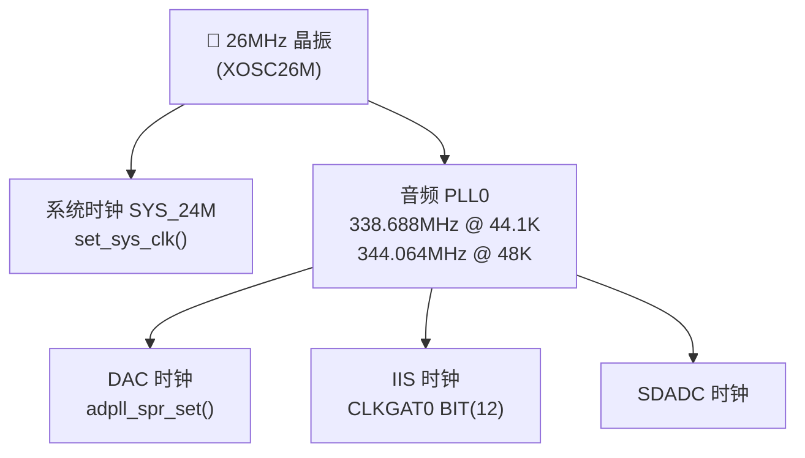

### 9.2 关键配置

```c
// config.h
#define SYS_CLK_SEL    SYS_24M    // 系统主频 = 24MHz

// bsp_dac_ext.c
audio_pll_init(DAC_OUT_44K1);     // 音频 PLL 锁定 44.1KHz 域

// PLL 分频比 (44.1K 域):
//   pll0div = (338.688 * 16777216) / 24 = 236,748,800
//   adpll_div = 15 (CLKCON2[7:4] = 0x0E)

// 时钟门控:
CLKGAT1 |= BIT(4);    // IIS 模块时钟使能
CLKGAT0 |= BIT(12);   // IIS/DAC 时钟源使能
CLKGAT2 |= BIT(15);   // DAC 时钟使能
```

---

## 10. 音量控制：数字音量 vs 模拟音量

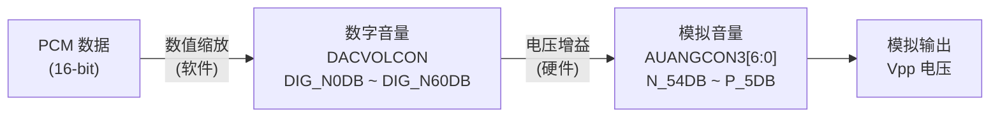

### 10.1 模拟音量对照表（常用部分）

| avol 索引 | 编码 | dB | 声音感受 |
|----------:|------|-----|---------|
| 0 | N_54DB | -54 | 几乎听不到 |
| 25 | N_29DB | -29 | 一般 |
| 40 | N_14DB | -14 | 比较响 |
| **50** | **N_4DB** | **-4** | **很大 (推荐)** |
| 53 | N_1DB | -1 | 接近上限 |
| 54 | N_0DB | 0 | 临界 |
| 55 | P_1DB | +1 | 可能削顶 |
| 59 | P_5DB | +5 | 必削顶 |

### 10.2 数字音量表

| 宏 | dB | 寄存器值 |
|----|-----|---------|
| `DIG_N0DB` | 0 (最大) | 0x7FFF |
| `DIG_N3DB` | -3 | 0x5A82 |
| `DIG_N6DB` | -6 | 0x4027 |
| `DIG_N12DB` | -12 | 0x2014 |
| `DIG_N60DB` | -60 (最小) | 0 |

---

## 11. GCC --wrap：如何覆盖库函数

### 11.1 问题

库里面已经有一个函数（如 `auxadc_pcm_to_dac()`），你想用自己的实现替换它。但它不是 weak symbol，直接同名会冲突。

### 11.2 解决方案

GCC 链接器的 `--wrap` 选项：

```text
库代码调用:          链接器改写:           你的实现:
auxadc_pcm_to_dac() ──→ __wrap_auxadc_pcm_to_dac()  ← 你写的
```

```xml
<!-- app/projects/standard/app.cbp -->
<Linker>
    <Add option="--wrap=auxadc_pcm_to_dac" />       <!-- A2 -->
    <Add option="--wrap=iis_master_srctx_init" />   <!-- A3 -->
    <Add option="--wrap=iis_slave_ram_rx_2_dac" />  <!-- A4 -->
</Linker>
```

> ⚠️ 链接器是 ld 直接调用，要写 `--wrap=xxx`，**不能**写 `-Wl,--wrap=xxx`（ld 不认识 `-Wl,` 前缀）。

### 11.3 本工程三个 --wrap 函数

| 原始函数 | __wrap 实现 | 文件 | 任务 |
|---------|------------|------|------|
| `auxadc_pcm_to_dac()` | `__wrap_auxadc_pcm_to_dac()` | `bsp_adc_pcm_to_dac_ext.c` | A2 |
| `iis_master_srctx_init()` | `__wrap_iis_master_srctx_init()` | `bsp_iis_master_ext.c` | A3 |
| `iis_slave_ram_rx_2_dac()` | `__wrap_iis_slave_ram_rx_2_dac()` | `bsp_iis_slave_ext.c` | A4 |

---

## 12. 内存与链接脚本

### 12.1 芯片内存布局

BT8920A2 有多个 RAM 区域，用途不同：

| 区域 | 用途 | 关键 section |
|------|------|-------------|
| comm | 通用数据 | `.bss`, `.data` |
| bram | 位操作优化 | `.iis2dac_buf` (IIS DMA 缓冲) |
| cram | 编解码 | — |
| aram | 音频算法 | `.dac_obuf` (DAC FIFO 环形缓冲) |

### 12.2 AT(.section) 段属性

```c
// 把变量/函数放到特定内存区域
u32 dac_obuf[576] AT(.dac_obuf);        // → aram
u8  iis_dmabuf1[2048];                  // → .iis2dac_buf → bram
void __wrap_xxx(void) AT(.com_text.iis_ext);  // → 特定代码段
```

`ram.ld` 链接脚本决定每个 section 最终放到哪个物理内存区域。

---

## 13. 四个任务全览 (A1→A4)

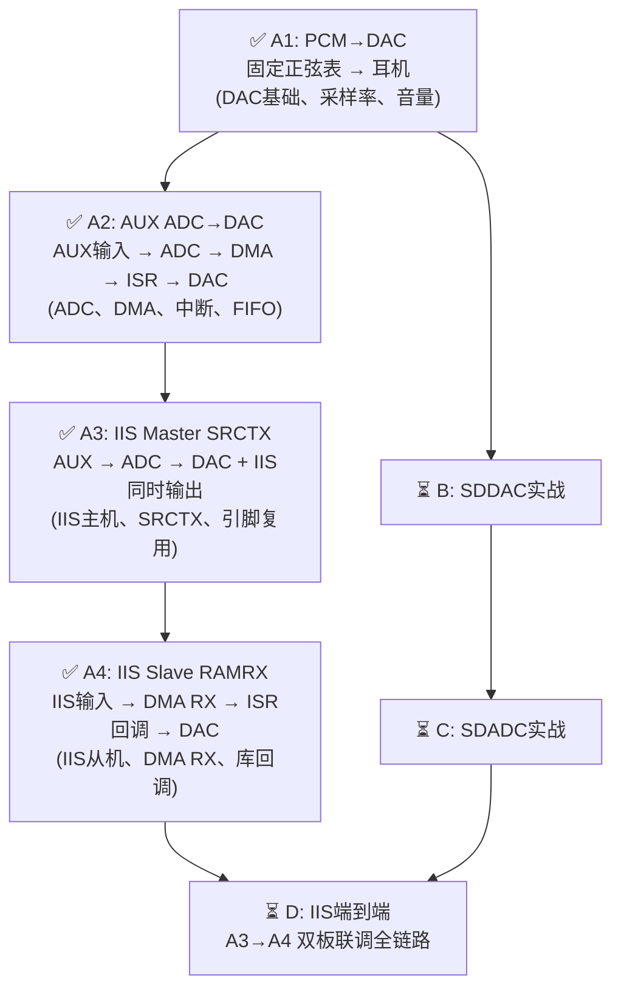

| 任务 | 数据流 | 核心知识点 | 文档 |
|------|--------|-----------|------|
| A1 | PCM 数组 → DAC → 耳机 | DAC、采样率、正弦表、音量 | [A1任务DAC正弦波教学.md](A1任务DAC正弦波教学.md) |
| A2 | AUX → ADC → DMA → ISR → DAC | ADC、DMA、中断、FIFO、--wrap | [A2任务降噪调优教学.md](A2任务降噪调优教学.md) |
| A3 | A2 + IIS SRCTX 同时输出 | IIS Master、SRCTX、引脚复用 | [A3任务IIS_MASTER_SRCTX教学.md](A3任务IIS_MASTER_SRCTX教学.md) |
| A4 | IIS RX → DMA → 回调 → DAC | IIS Slave、DMA RX、库回调 | [A4任务IIS_SLAVE_RAMRX教学.md](A4任务IIS_SLAVE_RAMRX教学.md) |

---

## 14. 任务 A1：PCM → DAC 正弦波

### 14.1 一句话概括

在代码里写一个正弦波数组，芯片循环读 → 写 DAC FIFO → DAC 变模拟电压 → 耳机听到声音。

### 14.2 核心代码骨架

```c
void test_pcm2dac(void)
{
    WDT_DIS();
    dac_spr_set(SPR_16000);        // ① 采样率 16kHz
    dac_set_dvol(DIG_N0DB);        // ② 数字音量最大
    dac_set_avol(50);              // ③ 模拟音量 -4dB

    u32 *pcm_buf = (u32*)A1_SINE_TABLE;
    u32 i = 0;

    while(1) {
        // ④ FIFO 没满就写, 满了就等
        if ((AUBUFCON & BIT(8)) == 0) {
            AUBUFDATA = pcm_buf[i++];       // 写入一个立体声样点
            if (i >= A1_SINE_TABLE_SIZE/4) i = 0;  // 循环
        }
    }
}
```

### 14.3 三种频率

| 频率 | 每周期点数 | 数组字节 | 公式 |
|------|-----------|---------|------|
| 500 Hz | 32 点 | 128 B | 16000/32=500 |
| 1000 Hz | 16 点 | 64 B | 16000/16=1000 |
| 2000 Hz | 8 点 | 32 B | 16000/8=2000 |

### 14.4 验收标准

- ✅ 示波器频率 = 500/980/1960 Hz（-2% 系统误差）
- ✅ 耳机听到对应音调
- ✅ 串口 `SampleRate ≈ 16000`
- ✅ 串口 `DACDIGCON0 = 0x219`

> 📖 **详见**：[A1任务DAC正弦波教学.md](A1任务DAC正弦波教学.md)

---

## 15. 任务 A2：AUX ADC → DAC 实时直通

### 15.1 一句话概括

电脑音频通过 AUX 线输入开发板 → SDADC 采样 → DMA 搬到内存 → 中断 ISR 里推到 DAC FIFO → 耳机实时听到电脑的声音。

### 15.2 数据流

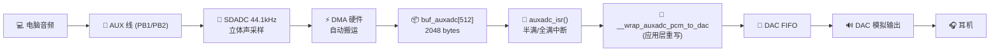

### 15.3 核心 ISR 函数

```c
// bsp_adc_pcm_to_dac_ext.c
void __wrap_auxadc_pcm_to_dac(u8 flag, u8 *adc_buf, u16 adc_samples)
{
    u16 *buf16 = (u16 *)adc_buf;
    u16 samples = adc_samples;

    AUBUFCON &= ~BIT(0);  // 确保 FIFO 没在 reset

    // ★ 关键: 根据 flag 只读安全的那一半数据
    u16 start, end;
    if (flag == 1) {
        start = 0;  end = samples / 2;      // Half Done: 只读前半
    } else {
        start = samples / 2;  end = samples; // Done: 只读后半
    }

    for (u16 i = start; i < end; i++) {
        if (AUBUFCON & BIT(8)) break;        // FIFO 满 → 跳过
        u16 left  = buf16[i * 2 + 0];
        u16 right = buf16[i * 2 + 1];
        AUBUFDATA = ((u32)right << 16) | (u32)left;
    }
}
```

### 15.4 噪音排查关键点

| 噪音 | 根因 | 修复 |
|------|------|------|
| 周期性"滋滋"声 (~86Hz) | DMA flag 没正确使用, 混入旧数据 | `flag=1` 只读前半, `flag=0` 只读后半 |
| 每秒"咔嗒"一声 | ISR 内串口打印 | `print_en()` 返回 `false` |
| 削顶失真 | 增益太高 | analog_gain=8, digital_gain=15 |

> 📖 **详见**：[A2任务降噪调优教学.md](A2任务降噪调优教学.md) 和 [噪音排查与修复指南.md](噪音排查与修复指南.md)

---

## 16. 任务 A3+A4：IIS 双板联调

### 16.1 一句话概括

**A3**：板 A 把 AUX 音频同时从 DAC 和 IIS 数字口输出。
**A4**：板 B 从 IIS 数字口接收音频，用 DAC 播放。
**两块板子用 4 根杜邦线连接，实现"无线"音频传输。**

### 16.2 双板接线

```text
   板 A (A3)                               板 B (A4)
  ┌──────────┐                            ┌──────────┐
  │  PE5 ●───┼──── BCLK ──────────────────┼───● PE5  │
  │  PE6 ●───┼──── LRC  ──────────────────┼───● PE6  │
  │  PE7 ●───┼──── DO   ──────┐           │          │
  │  GND ●───┼──── GND ───┐   ├──── 交叉 ─┼───● PB2  │
  │  PB1 ●───┼── AUX-L 输入 │   │          │          │
  │  PB2 ●───┼── AUX-R 输入 │   │          │          │
  └──────────┘              │   │          └──────────┘
                             │   │
                        PE7 ─┘   └─ PB2  (交叉! 不是直连)
```

### 16.3 A3 核心代码

```c
// bsp_iis_master_ext.c
void __wrap_iis_master_srctx_init(void)
{
    iis_cfg_t cfg;

    // 1) GPIO: PE5/PE6/PE7 = 输出, PB1 = 输入(关MCLK)
    GPIOEDE |= BIT(5)|BIT(6)|BIT(7);
    GPIOEFEN |= BIT(5)|BIT(6)|BIT(7);
    GPIOEDIR &= ~(BIT(5)|BIT(6)|BIT(7));
    GPIOBFEN &= ~BIT(1);  // ★ 不让 PB1 走 IIS MCLK

    // 2) 时钟门控
    CLKGAT1 |= BIT(4);    // IIS 模块时钟
    CLKGAT0 |= BIT(12);   // IIS 时钟源

    // 3) 配置 IIS
    memset(&cfg, 0, sizeof(cfg));
    cfg.mode        = IIS_MASTER_SRCTX;       // 主机 SRCTX
    cfg.iomap       = IIS_G2;                  // PE5/PE6/PE7
    cfg.bit_mode    = IIS_16BIT;
    cfg.data_mode   = IIS_DATA_NORMAL;
    cfg.mclk_sel    = IIS_MCLK_256FS;
    cfg.mclk_out_en = IIS_MCLK_OUT_DIS;       // 关 MCLK
    cfg.dma_en      = 0;                      // SRCTX 不需要 DMA

    iis_cfg_init(&cfg);
    iis_start();
}
```

### 16.4 A4 核心代码

```c
// bsp_iis_slave_ext.c
static iis_cfg_t iis_cfg_slave;  // ★ 必须 static, 不能放栈上!

void __wrap_iis_slave_ram_rx_2_dac(void)
{
    iis_cfg_t *cfg = &iis_cfg_slave;

    // 0) DAC 配置
    dac_spr_set(SPR_44100);    // 与 A3 板同步
    dac_set_dvol(DIG_N0DB);
    dac_set_avol(53);

    // 1) GPIO: PE5/PE6/PB2 = 输入
    GPIOEDE |= BIT(5)|BIT(6);
    GPIOEDIR |= BIT(5)|BIT(6);
    GPIOBDE |= BIT(2);
    GPIOBDIR |= BIT(2);

    // 2) 时钟门控
    CLKGAT1 |= BIT(4);
    CLKGAT0 |= BIT(12);

    // 3) 配置 IIS Slave
    memset(cfg, 0, sizeof(*cfg));
    cfg->mode        = IIS_SLAVE_RAMRX;        // 从机 RAMRX
    cfg->iomap       = IIS_G2;
    cfg->bit_mode    = IIS_16BIT;
    cfg->data_mode   = IIS_DATA_NORMAL;
    cfg->mclk_sel    = IIS_MCLK_256FS;
    cfg->mclk_out_en = IIS_MCLK_OUT_DIS;

    // 4) DMA 配置 (使用库回调)
    cfg->dma_cfg.samples            = 64;
    cfg->dma_cfg.dmabuf_len         = 2048;
    cfg->dma_cfg.dmabuf_ptr         = iis_dmabuf1;
    cfg->dma_cfg.iis_isr_rx_callbck = iis_rx_process_test; // ★ 库回调

    iis_cfg_init(cfg);
    iis_start();
}
```

### 16.5 A4 关键踩坑

```c
// ❌ 错误: cfg 放栈上
void __wrap_iis_slave_ram_rx_2_dac(void) {
    iis_cfg_t cfg;        // ← 函数返回后栈帧释放!
    iis_cfg_init(&cfg);   // 库保存了 &cfg → iis_libcfg
}
// → DMA 完成后 ISR 访问 iis_libcfg → 读到栈垃圾 0x23232323
// → CPU 跳到 EPC=0x23232324 → ERR:3/7 反复重启!

// ✅ 正确: cfg 用 static
static iis_cfg_t iis_cfg_slave;
void __wrap_iis_slave_ram_rx_2_dac(void) {
    iis_cfg_t *cfg = &iis_cfg_slave;  // 常驻内存, 安全!
    iis_cfg_init(cfg);
}
```

> 📖 **详见**：[A3任务IIS_MASTER_SRCTX教学.md](A3任务IIS_MASTER_SRCTX教学.md) 和 [A4任务IIS_SLAVE_RAMRX教学.md](A4任务IIS_SLAVE_RAMRX教学.md)

---

## 17. 文档索引

| 文档 | 定位 | 适合谁 |
|------|------|--------|
| **[BT8920A2音频完全入门指南.md](BT8920A2音频完全入门指南.md)** | 📘 **总地图**（本文） | 所有人先读这篇 |
| [A1任务DAC正弦波教学.md](A1任务DAC正弦波教学.md) | 📗 A1 零基础教学 | 第一次做 DAC 实验 |
| [A2任务降噪调优教学.md](A2任务降噪调优教学.md) | 📗 A2 零基础教学 | 第一次做 AUX ADC |
| [A3任务IIS_MASTER_SRCTX教学.md](A3任务IIS_MASTER_SRCTX教学.md) | 📗 A3 零基础教学 | 第一次做 IIS 发送 |
| [A4任务IIS_SLAVE_RAMRX教学.md](A4任务IIS_SLAVE_RAMRX教学.md) | 📗 A4 零基础教学 | 第一次做 IIS 接收 |
| [SDK入门与任务实施指南.md](SDK入门与任务实施指南.md) | 📕 综合技术参考 | 深入理解每个细节 |
| [噪音排查与修复指南.md](噪音排查与修复指南.md) | 📙 问题诊断 | 遇到噪音时查阅 |
| [I2S驱动资料.md](I2S驱动资料.md) | 📓 530X IIS 参考 | 理解 IIS 寄存器配置 |
| [待完成任务.md](待完成任务.md) | 📋 任务状态 | 看进度和下一步 |

### 阅读顺序建议

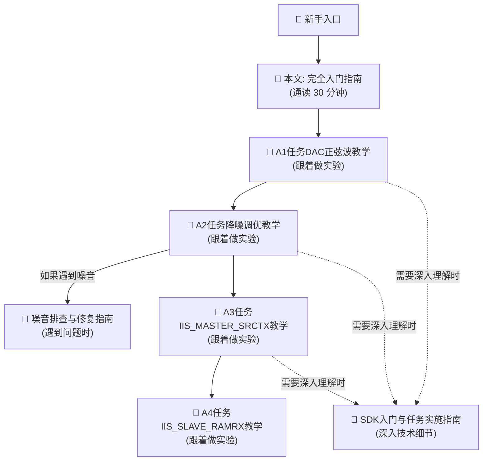

---

## 18. 学习路线图

### 18.1 阶段式学习 (预计 8~14 天)

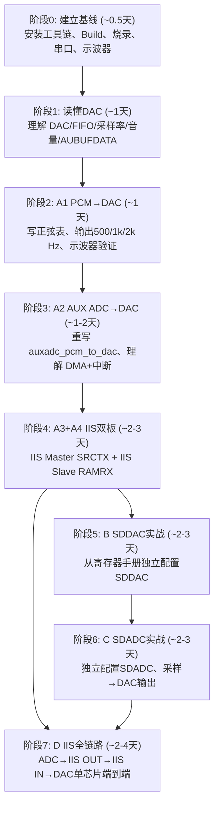

### 18.2 技能矩阵

| 知识点 | A1 | A2 | A3 | A4 | B | C | D |
|--------|:--:|:--:|:--:|:--:|:-:|:-:|:-:|
| DAC 基础 | ● | ● | ● | ● | ● | ● | ● |
| 采样率/正弦表 | ● | | | | ● | | |
| SDADC | | ● | ● | | | ● | ● |
| DMA | | ● | | ● | | ● | ● |
| 中断 ISR | | ● | | ● | | ● | ● |
| GCC --wrap | | ● | ● | ● | | | |
| IIS Master/SRCTX | | | ● | | | | ● |
| IIS Slave/RAMRX | | | | ● | | | ● |
| 库回调 | | | | ● | | | |
| PLL/时钟 | ● | ● | ● | ● | ● | ● | ● |
| GPIO/引脚复用 | | | ● | ● | ● | ● | ● |
| 寄存器级配置 | | | | | ● | ● | ● |

---

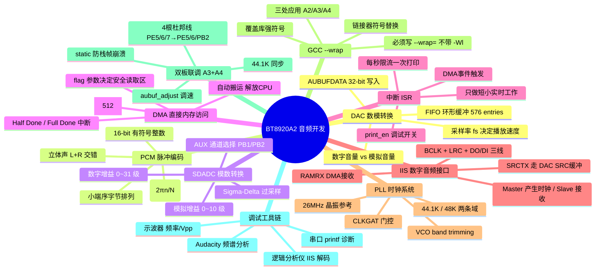

---

> **文档版本**：v1.0
> **编写日期**：2026-07-30
> **工程仓库**：`git@github.com:zglstudylinux/APP_8920A2_DAC_ADC_IIS_NEW_TEST.git`
> **分支**：`main` / `new_minimax_zgl01`

**入门指南结束。** 如果你从第 1 节读到第 18 节，理解了 DAC/ADC/IIS/PCM/DMA/中断/PLL/--wrap 这些核心概念，以及 A1~A4 四个任务的数据流和关键代码，你就已经具备了独立完成所有实验的基础。现在打开 [A1任务DAC正弦波教学.md](A1任务DAC正弦波教学.md) 开始第一个实验吧！
