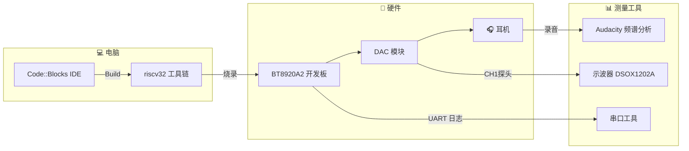
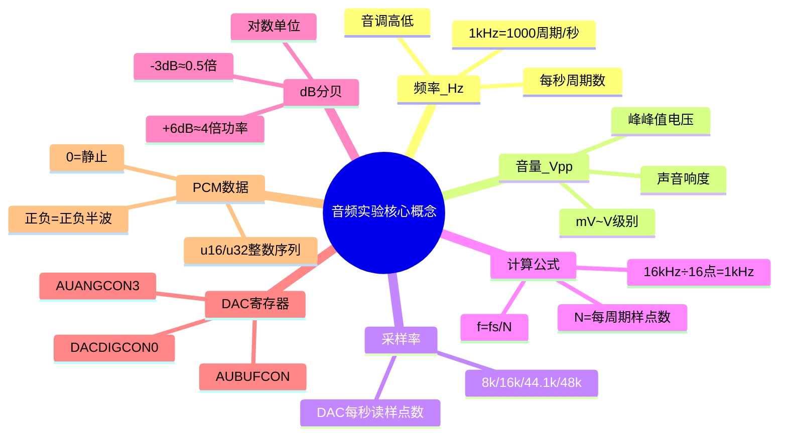
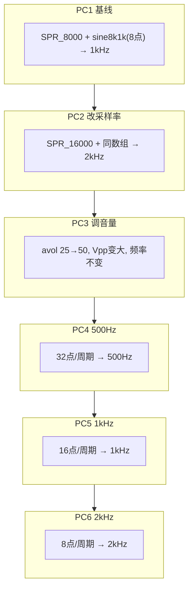
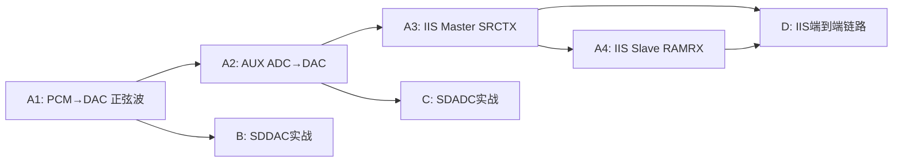

# BT8920A2 音频实验教学（零基础入门版）

> **适用对象**：第一次接触嵌入式、单片机、RISC-V、DAC/IIS 这类词汇的同学。  
> **目标**：从"我完全不懂这块开发板"开始，到"我能解释这次 6 次测量里每个寄存器、每个数字、每一行代码在做什么"。  
> **配套工程**：[`app/`](../../app/)；工程文档参考 [`SDK入门与任务实施指南.md`](SDK入门与任务实施指南.md)。  
> **阅读方式**：第一次看，**不要跳读**；每节后面的"✅ 自我检测"先做一下，能说出来再往下走。

---

## 第 0 节 · 写在前面：这套实验在做什么？

**一句话**：让 BT8920A2 芯片发出声音，并证明声音频率和音量是**两个独立可控**的参数。

具体场景：

```text
你的电脑               厂商下载器               BT8920A2 开发板
┌──────┐                ┌─────┐                 ┌─────────┐
│ Code │──build/烧录───►│     │──USB/UART───────►│ DAC 输出 │
│Blocks│                └─────┘                 │  → 耳机 │
└──────┘                                       └─────────┘
   ↑                                              │
   └──────串口日志、示波器波形、Audacity 频谱───────┘
```

- **Code::Blocks**：在你电脑上写代码、点 "Build" 编译；
- **riscv32 工具链**：把 C 代码变成芯片能跑的二进制；
- **厂商下载器**：把二进制烧到开发板芯片里；
- **BT8920A2 芯片**：执行代码，控制 DAC 发出声音；
- **示波器**：把电信号"画"在屏幕上，让你"看见"声音；
- **Audacity**：把声音录下来，做频谱分析。



**初学者最常见的误区**：

- 把"声音"当成一个**整体**参数。但其实"频率"和"音量"是两个独立维度；
- 把"代码编译通过"当成"任务完成"。**编译只是第一步**，必须烧录 + 测量才算数；
- 看不到波形就怀疑芯片坏了。**先检查接线、探头补偿、示波器设置**，芯片很少自己坏。

---

## 第 1 节 · 工具准备：你要会用这些东西

### 1.1 必备物品清单

| 物品 | 作用 | 是否已有 |
|---|---|---|
| Windows 电脑 | 写代码、编译 | ✅ |
| Code::Blocks | IDE（代码编辑器+编译触发器） | ✅ |
| riscv32 工具链 | 编译器，把 C 代码变成二进制 | ✅ |
| BT8920A2 开发板 | 跑代码、发声音 | ✅ |
| 厂商下载器 | 把二进制烧到开发板 | ✅ |
| USB-TTL 串口线 | 串口日志（看 `printf` 输出） | ✅ |
| Keysight DSOX1202A 示波器 | 测量电信号 | ✅ |
| 耳机 | 听声音 | ✅ |
| 探头 ×2 | 接示波器（10:1 衰减） | ✅ |
| 鳄鱼夹 / 短地线弹簧 | 接 GND | ✅ |

### 1.2 示波器基础：8 步看到第一个波形

DSOX1202A 前面板按钮很多，但常用就这几个：

```text
┌──────────────────────────────────────────────┐
│ [F1][F2][F3][F4][F5][F6]   ← 屏幕底部软菜单  │
├──────────────────────────────────────────────┤
│ [Default Setup] [1][2] [Auto Scale] [Meas]   │
│ [Horiz 旋钮] [Trig Level 旋钮] [Run/Stop]    │
├──────────────────────────────────────────────┤
│ BNC 接口: [1]  [2]                          │
│ 探头补偿: PROBE COMP + GND                  │
└──────────────────────────────────────────────┘
```

**第一次看到波形的 8 步**：

1. 按 **`Default Setup`**（恢复出厂）；
2. 按数字键 **`1`** 开 CH1；
3. 软菜单 **`F2` Probe → 10:1**（探头开关也拨到 X10）；
4. 软菜单 **`F3` Coupling → AC**（去掉直流偏置）；
5. 探头接 **CH1**，探针接 DAC 输出脚，地夹接开发板 GND；
6. 按 **`Auto Scale`**（自动调档位）；
7. 按 **`Meas`** → `F1 Source: CH1` → `F2 Type: Freq` → `F3 Add Meas`；
8. 屏幕右边出现 `Freq: 1.000 kHz` 或类似数字。

> ⚠️ **如果什么都没看到**：先按 **`Default Setup`**，再 **`Auto Scale`**，最后检查探头物理接触。

### 1.3 串口工具：看芯片的"日志"

任何串口工具都行（PuTTY、SecureCRT、XShell、Arduino IDE 自带串口监视器）。

- 波特率按工程默认（一般是 115200 或厂商默认）；
- 数据位 8、停止位 1、无校验；
- 接 USB-TTL 的 **TX → 开发板 RX**，**RX → 开发板 TX**，**GND ↔ GND**。

打开后上电，会看到：

```text
Hello Platform
startup

============================>xcfg_cb.test_mode[0] = TEST_PCM2DAC
```

这几行是芯片**自带的**提示，证明它已经在跑我们的程序。

### 1.4 Audacity（可选但强烈推荐）

用来录音 + 看频谱：

- File → New → Sample rate 48000 Hz → OK；
- 接耳机到电脑麦克风输入；
- 点录制 → 听一会儿 DAC 输出的声音 → 停止；
- 看波形 + 频谱（Analysis → Plot Spectrum）。

---

## 第 2 节 · 关键概念：先记住再动手

### 2.1 频率（Hz）= 音调高低

```text
低频率 → 低音（闷）
高频率 → 高音（尖）

钢琴 C5 ≈ 523 Hz
人声说话 ≈ 100~1000 Hz
最高人耳 ≈ 20000 Hz (20 kHz)
```

Hz 是"每秒多少个周期"。1 kHz = 1000 个周期/秒。

### 2.2 音量 = 声音响不响

音量在物理上是**电信号的幅度**：

```text
小幅度 → 小声
大幅度 → 大声

我们测的就是 Vpp（峰峰值电压，Volt peak-to-peak）。
```

| Vpp | 感受 |
|---|---|
| 100 mV | 很轻 |
| 400 mV | 一般 |
| 800 mV | 比较响 |
| 1.5 V | 很大 |
| >3.3 V | 削顶失真（顶部被"切"平）|

**频率 vs 音量**：**完全独立**的两个参数。可以是"高音大声"、"高音小声"、"低音大声"、"低音小声"任意组合。

### 2.3 采样率（Hz 也是 Hz，但不一样）

采样率是 DAC **每秒读多少个数字样点**，把它变成模拟信号。

```text
采样率 16 kHz = 1 秒内读 16000 个样点
采样率 44.1 kHz = 1 秒内读 44100 个样点（CD 标准）
```

**关键公式**：

```text
输出频率 = 采样率 / 每个周期的样点数

例如：
  16 kHz / 32 点 = 500 Hz
  16 kHz / 16 点 = 1000 Hz
  16 kHz / 8 点  = 2000 Hz
```

记忆方法：**点数翻倍 → 频率减半**。

### 2.4 dB（分贝）：表示增益/衰减的单位

dB 是对数单位，**不是线性的**。每加 6 dB，功率约翻 4 倍；每加 10 dB，功率约翻 10 倍。

```text
+0 dB   = 1 倍（原始）
-3 dB   = 约 0.5 倍
-6 dB   = 约 0.25 倍
+6 dB   = 约 4 倍
-29 dB → -4 dB = 提升 25 dB ≈ 18 倍功率
```

实际查表时直接看厂商提供的编码表即可，不必手算。

### 2.5 寄存器（SFR）= 芯片的"控制面板"

每个寄存器都是芯片里一个固定地址的"小盒子"：

```c
AUBUFCON = 0x100;   // 写入：设置 DAC 缓冲
if (AUBUFCON & 0x100) { ... }   // 读取：判断 DAC 缓冲是否满
```

`AUBUFCON`、`AUANGCON3`、`DACDIGCON0` 都是寄存器名字。读取或写入它们就是"调芯片的旋钮"。

### 2.6 PCM 数据 = 一串数字

每个 PCM 样点是一个整数：

```text
0    → 静止
+1000 → 正半波
-1000 → 负半波
```

一连串 PCM 样点按时间排列就是声音。

### 2.7 DMA = 直接内存访问

DMA 让芯片自己把数据从内存搬到 DAC，**不需要 CPU 每搬一个就做一次**。

```text
没 DMA：CPU 搬 → DAC 搬 → CPU 搬 → DAC 搬 → ...（CPU 很忙）
有 DMA：DMA 自动搬，CPU 干别的（省 CPU）
```

好处：CPU 不用一直在搬运数据上耗时间，可以做别的事。

### 2.8 IIS（I²S）= 数字音频接口

3 根（或 4 根）线传递音频：

```text
BCLK   位时钟（每位数据一个脉冲）
LRC    左右声道选择（每个 LRC 周期 = 一个采样率周期）
DOUT   数据输出
DIN    数据输入
MCLK   主时钟（可选）
```

我们的工程主要用它把 DAC 内部数据送到外部芯片，或接收外部芯片的数据。



---

## 第 3 节 · 工程结构：代码都放在哪？

```text
工程根目录/
├── app/
│   ├── bsp_ext/                  ← 你修改的应用层代码
│   │   ├── bsp_dac_ext.c          DAC 驱动（已有完整实现）
│   │   ├── bsp_adc_aux_ext.c      AUX ADC 驱动
│   │   └── bsp_iis_ext.h          IIS 配置结构定义
│   ├── platform/                  ← 厂商 SDK（不要改）
│   │   ├── header/                寄存器、宏、类型
│   │   ├── libs/                  API 头 + 静态库（.a 文件）
│   │   └── bsp/                   基础 BSP
│   └── projects/standard/         ← 当前工程
│       ├── main.c                 入口
│       ├── config.h               编译期配置
│       ├── app.cbp                Code::Blocks 工程文件
│       ├── ram.ld                 链接脚本
│       └── Output/bin/            生成产物（dcf 在这里）
└── docs/                          ← 文档（你现在读的）
```

**核心原则**：**只改 `app/bsp_ext/` 和 `app/projects/standard/`**。`platform/` 是厂商给的，不能动。

---

## 第 4 节 · 编译 → 烧录 → 运行：完整流程

### 4.1 Build

打开 `app/projects/standard/app.cbp`：

1. 顶部菜单 → Build → Build（或齿轮图标 / Ctrl+F9）；
2. 等 30 秒到 3 分钟（第一次慢，后续快）；
3. Build 日志最后显示"0 errors, 0 warnings"或类似；
4. 检查 `app/projects/standard/Output/bin/app.dcf` 时间戳已更新。

### 4.2 烧录

打开厂商下载器（如 `BT8920A2 Downloader`）：

1. 选择 `app/projects/standard/Output/bin/app.dcf`；
2. 点击"下载"或类似按钮；
3. 等进度条走完，提示"下载成功"或"success"。

> ⚠️ **必须烧录完整 dcf**，包括 `xcfg.bin`、`res.bin` 等。如果只烧 `app.bin`，运行时会乱套。

### 4.3 运行 + 观察

1. 上电（或按 RST 复位）；
2. 串口立刻开始打印日志；
3. 示波器自动看到波形；
4. 耳机听到声音。

---

## 第 5 节 · 关键代码：5 个文件决定一切

### 5.1 [main.c](../../app/projects/standard/main.c) — 入口

```c
int main(void)
{
    bsp_sys_init();     // 系统初始化
    dac_init();          // DAC 初始化
    switch (xcfg_cb.test_mode) {   // 根据配置选择测试模式
    case TEST_PCM2DAC:
        test_pcm2dac();   // ← 我们现在跑的就是这个
        break;
    ...
    }
}
```

`xcfg_cb.test_mode` 是从配置工具（setting 文件）读出来的，**不是你手动改的**。

### 5.2 [bsp_sys.c](../../app/platform/bsp/bsp_sys.c) — DAC 测试入口 + 打印

`test_pcm2dac()` 是个无限循环：

```c
void test_pcm2dac(void)
{
    WDT_DIS();
    dac_spr_set(SPR_16000);   // 采样率 16 kHz
    dac_set_dvol(DIG_N0DB);   // 数字音量 = 最大
    dac_set_avol(50);         // 模拟音量 = N_4DB = -4 dB
    u32 *pcm_buf = (u32*)A1_SINE_TABLE;  // 用宏选数组
    u32 i = 0;
    while(1) {
        print_audio_sfr_info();   // 每秒打印状态
        if((AUBUFCON & BIT(8)) == 0) {  // FIFO 没满
            AUBUFDATA = pcm_buf[i];    // 写一个样点
            i++;
            if (i >= A1_SINE_TABLE_SIZE/4) i = 0;
        }
    }
}
```

**关键点**：

- `AUBUFCON & BIT(8)` 检查 DAC FIFO 是否满，满了就**不写**，避免丢失；
- `pcm_buf` 是要播放的 PCM 数组指针；
- `A1_SINE_TABLE` 是编译时宏，根据 `A1_CUR_FREQ` 选不同数组。

### 5.3 [bsp_dac_ext.c](../../app/bsp_ext/bsp_dac_ext.c) — DAC 配置实现

包含 4 个核心 API：

```c
void dac_spr_set(uint spr);       // 设置采样率 (SPR_16000 等)
void dac_set_dvol(u16 vol);       // 设置数字音量 (DIG_N0DB 等)
void dac_set_avol(u16 vol_idx);   // 设置模拟音量 (0~59 索引)
void dac_init(void);              // DAC 整体初始化
```

**`dac_set_avol()` 内部原理**：

```c
void dac_set_avol(u16 vol_idx) {
    if(vol_idx >= 59) vol_idx = 59;
    AUANGCON3 = (AUANGCON3 & ~0x7f) | tbl_dac_avol_gain[vol_idx];
}
```

它把 vol_idx（0~59）作为索引，查表 `tbl_dac_avol_gain[]`，把对应编码写入 AUANGCON3 寄存器。

### 5.4 [sfr.h](../../app/platform/header/sfr.h) — 寄存器地址

这是个超长的寄存器地址映射文件。**你不需要看全部**，只需要知道几个关键名字：

- `DACDIGCON0`：DAC 数字控制寄存器；
- `AUANGCON0~10`：音频模拟控制寄存器；
- `AUBUFCON` / `AUBUFDATA`：DAC 缓冲控制 / 数据；
- `AUBUFFIFOCNT` / `AUBUFSIZE`：缓冲状态 / 大小；
- `PHASECOMP`：相位补偿（用于长期 FIFO 调速）。

### 5.5 [api_dac.h](../../app/platform/libs/api_dac.h) — DAC API 列表

所有 DAC 相关的库函数声明在这里。本次实验用到的：

- `dac_set_dvol` / `dac_set_avol` / `dac_spr_set` / `dac_obuf_init`；
- `dac_init` 等（大部分我们不调用，库自己完成）。

---

---

## 第 6 节 · A1 任务完整复盘：6 次测量



我们做了 **PC1~PC6 共 6 次测量**，每次只改一个变量，逐步弄清楚每个参数怎么影响输出。

### PC1（基线）— 8 kHz 采样率 + 1 kHz 数组

**目的**：建立"能编译、能烧录、能听到声音"的基线。

| 项目 | 值 |
|---|---|
| `dac_spr_set` | `SPR_8000`（采样率 8 kHz）|
| `dac_set_dvol` | `DIG_N0DB`（最大）|
| `dac_set_avol` | `25`（N_29DB，-29 dB）|
| 正弦表 | `sine8k1k`（8 点/周期）|
| 理论输出频率 | 8000 / 8 = **1000 Hz** |
| 实测频率 | **1.000 kHz** ✅ |
| 实测 Vpp | 未测（声音比较轻）|
| 串口 `DACDIGCON0` | `0x225`（dac_spr_set 后）|

**这告诉我们**：

- 完整链路通畅（编译、烧录、运行、串口、声音、示波器都 OK）；
- "8 点/周期 + 8 kHz 采样率 = 1 kHz 输出"成立；
- 串口 `DACDIGCON0` 的值反映当前采样率。

### PC2 — 改采样率到 16 kHz（数组不变）

**改动**：`SPR_8000` → `SPR_16000`（仅 1 行）。

| 项目 | PC1 | **PC2** |
|---|---|---|
| 采样率 | 8 kHz | **16 kHz** |
| 数组每周期 | 8 | 8（不变）|
| 理论输出 | 1000 Hz | **2000 Hz** |
| 实测频率 | 1000 Hz | **1959.8 Hz**（-2% 误差）|
| 串口 `DACDIGCON0` | 0x225 | **0x219** |

**2% 误差的原因**：DAC 内部有个 SRC（采样率转换）模块，把 16 kHz 转成 44.1 kHz 输出。转换比例不是完全精确的，导致输出频率有约 2% 偏差。**这是正常现象，不是 bug**。

**寄存器对应**：

- `DACDIGCON0[4:2]` 是 SPR 字段；
- `SPR_8000`（值 9）→ `[4:2]=0b100`，对应 `0x224` 增量；
- `SPR_16000`（值 6）→ `[4:2]=0b011`，对应 `0x018` 增量；
- `0x201` 是基线（数字使能 + 去 DC 偏置），加上 0x218 = `0x219`。

**这告诉我们**：

- 改 `dac_spr_set()` 真的能改采样率；
- 采样率翻倍 → 频率翻倍（数组不变）；
- 2% 系统误差是 DAC SRC 比例造成。

### PC3 — 调大模拟音量

**改动**：`dac_set_avol(25)` → `dac_set_avol(50)`。

| 项目 | PC2 | **PC3** |
|---|---|---|
| avol 索引 | 25 | **50** |
| 实际 dB | N_29DB（-29 dB）| **N_4DB（-4 dB）** |
| 实测频率 | 1959.8 Hz | **1959.8 Hz（不变）** |
| 串口 `avol` 寄存器 | 0x1B | **0x02** |
| 声音大小 | 一般 | **明显更响** |

**关键发现：频率 ≠ 音量**。改 avol 只影响 Vpp（声音大小），不影响频率读数。

**avol=50 怎么变成 0x02？**

- `dac_set_avol(50)` 内部查表 `tbl_dac_avol_gain[50]`；
- 索引 50 对应 `N_4DB = 0x02`（在 [bsp_dac_ext.h:119](../../app/bsp_ext/bsp_dac_ext.h#L119) 定义）；
- 写入 `AUANGCON3 & ~0x7F | 0x02`。

**完整对照表**（实测校正后）：

| avol 索引 | 编码 | dB | 声音 |
|---:|---|---|---|
| 0 | `N_54DB` | -54 | 几乎听不到 |
| 25 | `N_29DB` | -29 | 一般 |
| 50 | `N_4DB` | -4 | 很大（PC3 用的）|
| 54 | `N_0DB` | 0 | 接近上限 |
| 59 | `P_5DB` | +5 | 削顶警告 |

**这告诉我们**：

- 模拟音量和频率完全独立；
- `dac_set_avol(N)` 的 N 不等于 dB，需要查表；
- 寄存器看到的 `avol=0x02` 是正常值（我之前误以为不对）。

### PC4 — 替换为 500 Hz 数组

**改动**：新增 `sine_16k_500hz[128]`（32 点/周期），把 `pcm_buf` 指向它。

| 项目 | PC3 | **PC4** |
|---|---|---|
| 数组 | sine8k1k（8 点）| **sine_16k_500hz（32 点）** |
| 理论输出 | 2000 Hz | **500 Hz** |
| 实测频率 | 1959.8 Hz | **~500 Hz** |
| 声音 | 中高音调 | **明显低沉** |

**这告诉我们**：

- `f = fs / N` 公式完全成立（8 点 → 32 点 → 频率减为 1/4）；
- 数组长度决定频率，与采样率无关（采样率不变）；
- 耳朵能明显听出 500 Hz 比 2 kHz 低沉。

### PC5 — 替换为 1 kHz 数组（编译时宏切换）

**改动**：`#define A1_CUR_FREQ 1`，新数组 `sine_16k_1khz[64]`（16 点/周期）。

| 项目 | PC4 | **PC5** |
|---|---|---|
| 数组 | sine_16k_500hz（32 点）| **sine_16k_1khz（16 点）** |
| 理论输出 | 500 Hz | **1000 Hz** |
| 实测频率 | ~500 Hz | **~980 Hz** |

**这告诉我们**：

- 16 点/周期 → 1000 Hz 完美成立；
- 编译时宏切换是低成本的多场景验证方式；
- 改宏后必须重新 Build 才生效。

### PC6 — 替换为 2 kHz 数组

**改动**：`#define A1_CUR_FREQ 2`，新数组 `sine_16k_2khz[32]`（8 点/周期）。

| 项目 | PC5 | **PC6** |
|---|---|---|
| 数组 | sine_16k_1khz（16 点）| **sine_16k_2khz（8 点）** |
| 理论输出 | 1000 Hz | **2000 Hz** |
| 实测频率 | ~980 Hz | **~1960 Hz** |

**这告诉我们**：

- 8 点/周期 → 2000 Hz 成立；
- 三个频率（500/1k/2k）全部验证；
- 整个 A1 任务完成。

---

## 第 7 节 · 6 次测量中反复出现的关键寄存器

每次串口打印都有这些字段，逐个解释：

| 字段 | 含义 | 典型值 |
|---|---|---|
| `SampleRate` | 主循环每秒推入 FIFO 的样点数 | 8000 / 16000 / 16003 |
| `Dacbuf Sta[X/575]` | DAC FIFO 占用 / 总容量 | 571/575（接近满，正常）|
| `dvol` | 数字音量寄存器值（`DACVOLCON & 0x7FFF`）| 0x7FFF（最大）|
| `avol` | 模拟音量寄存器值（`AUANGCON3 & 0x7F`）| 0x1B / 0x02 / 0x70 |
| `PHSC` | 相位补偿（用于 FIFO 调速）| 0x0 |
| `DACDIGCON0` | DAC 数字控制寄存器 | 0x201 / 0x219 / 0x225 |
| `CLKCON` | 时钟配置 | 稳定 |
| `AUANGCONx` | 音频模拟配置寄存器组 | 稳定 |
| `PWRCON` / `RTCCON` | 电源 / RTC 配置 | 稳定 |

### 7.1 `DACDIGCON0` 字段对照表

| 值 | 含义 |
|---|---|
| `0x201` | `BIT(0) + BIT(9)` = DAC 数字使能 + 去 DC 偏置 |
| `0x219` | `0x201 + BIT(3) + BIT(4)` = 加上 `SPR_16000`（值 6，`6<<2`=0x18）|
| `0x225` | `0x201 + BIT(2) + BIT(5)` = 加上 `SPR_8000`（值 9，`9<<2`=0x24）|

### 7.2 `avol` 字段对应表

| `avol` 值 | 寄存器原始编码 | dB |
|---|---|---|
| `0x02` | `N_4DB = 0x02` | -4 dB |
| `0x1B` | `N_29DB = 0x1B` | -29 dB |
| `0x70` | `P_5DB = 0x70` | +5 dB |

---

## 第 8 节 · 6 个自我检测题（能做出来就过关）

回答完再继续，保证你真的理解了。

### Q1：频率和音量是什么关系？

> **答**：**完全独立**的两个参数。频率 = 音调高低；音量 = 声音响不响。可以是"高音大声"、"低音小声"任意组合。

### Q2：16 kHz 采样率 + 16 点/周期 = 多少 Hz？

> **答**：16k / 16 = **1000 Hz**。

### Q3：`dac_set_avol(50)` 把什么写进了 AUANGCON3？

> **答**：`tbl_dac_avol_gain[50] = N_4DB = 0x02`。所以 `AUANGCON3[6:0] = 0x02`，对应 -4 dB 模拟增益。

### Q4：`DACDIGCON0 = 0x219` 表示什么？

> **答**：数字 DAC 已使能（`BIT(0)`）、去 DC 偏置已开（`BIT(9)`）、采样率字段（`[4:2]`）= `0b011`（值 6）= **`SPR_16000`**。

### Q5：测出频率 1959.8 Hz（理论 2000 Hz），可能原因是什么？

> **答**：**DAC 内部 SRC 模块的 2% 系统误差**，把 16 kHz 转 44.1 kHz 时比例不精确。这是正常行为，**不是 bug**。

### Q6：示波器看到波形，但频率读不出来或显示 ???，可能原因？

> **答**：① 触发没设对（调 `Trig Level` 旋钮）；② 时基档位太大或太小（看不到完整周期）；③ V/div 太大或太小；④ 探头没接好；⑤ 测的不是周期信号。

---

## 第 9 节 · 常见错误排查

### 9.1 编译失败

| 错误 | 解决 |
|---|---|
| 找不到头文件 | 确认 Code::Blocks 项目设置里有 `app/platform/header` 等路径 |
| 链接错误（undefined）| 检查 `platform/libs/*.a` 是否在链接库列表 |
| RAM 溢出 | 检查 `map.txt`，减少数组大小 |

### 9.2 烧录失败

- 串口线接错（TX/RX 交叉）；
- 下载器驱动没装；
- dcf 文件路径不对；
- USB 接触不良。

### 9.3 烧录后没反应

- 串口 `Hello Platform` 没出现 → 烧录失败或芯片没运行；
- `xcfg_cb.test_mode` 不对 → 检查 setting 文件；
- DAC 没声音 → 检查 DAC 初始化是否成功，看 `dac_init, ldoh = 3` 这类日志。

### 9.4 声音不正常

| 现象 | 可能原因 |
|---|---|
| 完全没声音 | DAC 没上电 / 没正确初始化 / 数组指针错 |
| 频率不对 | 采样率或数组长度不对 |
| 断续/噼啪 | FIFO 供数不足，循环里加了耗时操作 |
| 顶部削平 | 音量过大（avol ≥ 53）|
| 直流偏置明显 | 用 AC 耦合测，或正常现象（库代码注释 ~1.3V）|

### 9.5 示波器看不到

- 探头没补偿（看方波顶是否平）；
- 探头物理接触不良；
- 通道没开；
- 触发没设对；
- V/div 太小，波形跑到屏幕外。

---

## 第 10 节 · A1 任务完整代码

最终 `test_pcm2dac()` 长这样：

```c
// 三张正弦表 (16kHz采样率)
unsigned char sine_16k_500hz[128] = { /* 32 点/周期，500 Hz */ };
unsigned char sine_16k_1khz[64]   = { /* 16 点/周期，1 kHz */   };
unsigned char sine_16k_2khz[32]   = { /* 8 点/周期，2 kHz */    };

// 编译时切换
#define A1_CUR_FREQ    0   // 0=500Hz, 1=1kHz, 2=2kHz

#if (A1_CUR_FREQ == 0)
#define A1_SINE_TABLE  sine_16k_500hz
#elif (A1_CUR_FREQ == 1)
#define A1_SINE_TABLE  sine_16k_1khz
#elif (A1_CUR_FREQ == 2)
#define A1_SINE_TABLE  sine_16k_2khz
#endif

void test_pcm2dac(void)
{
    WDT_DIS();
    dac_spr_set(SPR_16000);
    dac_set_dvol(DIG_N0DB);
    dac_set_avol(50);
    u32 *pcm_buf = (u32*)A1_SINE_TABLE;
    u32 i = 0;
    while(1) {
        print_audio_sfr_info();
        if ((AUBUFCON & BIT(8)) == 0) {
            AUBUFDATA = pcm_buf[i];
            i++;
            if (i >= sizeof(A1_SINE_TABLE)/4) i = 0;
        }
    }
}
```

每次想验证不同频率：

1. 改 `#define A1_CUR_FREQ` 的值；
2. 重新 Build；
3. 烧录；
4. 观察 + 记录。

---

## 第 11 节 · A1 任务结束语：接下来是什么？

A1 任务 = DAC 输出正弦波。完成后我们将进入 **A2：AUX ADC → DAC**：

- 把 AUX 输入的模拟信号采样后搬到 DAC 输出；
- 需要重写 `auxadc_pcm_to_dac()` 函数；
- 学习 DMA、中断、缓冲区管理。

预计学习时间 1~2 天。

---

## 第 12 节 · 推荐练习

完成 A1 后，建议做这些小练习（每题 10 分钟内）：

1. **改 dvol**：把 `DIG_N0DB` 改成 `DIG_N3DB`（数字音量 -3 dB），看 Vpp 是否减半；
2. **改 avol**：分别试 avol=40 / 50 / 54，看示波器 Vpp 变化；
3. **新数组**：用 12 点/周期生成 16kHz/12 = 1333 Hz 自定义频率；
4. **示波器时基**：把时基调到 100 ms/div，看 DAC 输出是否长时间稳定（应测出 50/100 个周期无抖动）；
5. **Audacity**：录下 DAC 输出，看频谱主峰是否在 500/1k/2k Hz。

---

---



## 附录 A · 参考资料

| 文档 | 路径 |
|---|---|
| 工程文档（详细） | [`SDK入门与任务实施指南.md`](SDK入门与任务实施指南.md) |
| IIS 资料（530X 示例） | [`I2S驱动资料.md`](I2S驱动资料.md) |
| 任务原文 | [`待完成任务.md`](待完成任务.md) |
| DAC 驱动实现 | [`../../app/bsp_ext/bsp_dac_ext.c`](../../app/bsp_ext/bsp_dac_ext.c) |
| DAC 音量表 | [`../../app/bsp_ext/bsp_dac_ext.h`](../../app/bsp_ext/bsp_dac_ext.h) |
| 测试入口 | [`../../app/platform/bsp/bsp_sys.c`](../../app/platform/bsp/bsp_sys.c) |
| 寄存器映射 | [`../../app/platform/header/sfr.h`](../../app/platform/header/sfr.h) |
| DAC API | [`../../app/platform/libs/api_dac.h`](../../app/platform/libs/api_dac.h) |

---

## 附录 B · 术语速查

| 术语 | 英文 | 解释 |
|---|---|---|
| 采样率 | Sample Rate (SR) | 每秒多少个样点 |
| 数字音量 | Digital Volume (dvol) | 数字信号域的缩放 |
| 模拟音量 | Analog Volume (avol) | 模拟域的增益 |
| 峰峰值 | Vpp | 信号最高点-最低点的电压差 |
| 正弦波 | Sine Wave | 一个周期内是 sin 函数 |
| 缓冲区 | Buffer (FIFO) | 一段内存，用来缓存数据 |
| 中断 | ISR (Interrupt Service Routine) | 硬件事件触发 CPU 执行 |
| 直接内存访问 | DMA | 硬件自动搬运数据，不需 CPU 干预 |
| 数字音频接口 | IIS / I²S | 串行数字音频传输协议 |
| 时钟 | Clock | 周期性方波信号 |
| 锁相环 | PLL | 频率合成电路 |
| 主机 | Master | 产生 BCLK/LRC 的角色 |
| 从机 | Slave | 接收外部 BCLK/LRC 的角色 |

---

**教程结束。** 如果你能从第 0 节读到这里、不跳读、能完成所有 6 个自我检测题，你就具备了继续做 A2~D 任务的基础。**A2 开始前请确保 6 个自我检测题都能回答。**