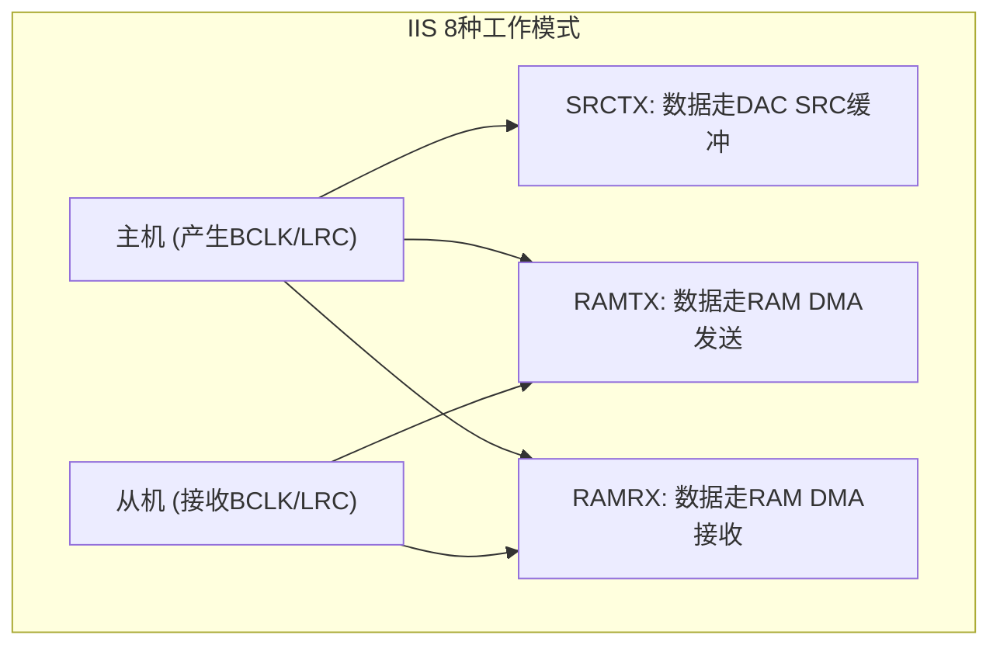
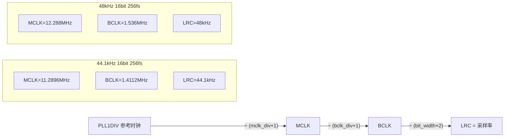

# IIS 驱动资料

- 公司各芯片IIS模块基本一样,下面以530X芯片的IIS为例讲解IIS.
- IIS可以配置为8种工作模式如下:



```
//NOTE:
//SRCTX: IIS从SRC(DAC_BUF变采样后)拿数据推出,声音可以和DAC同时输出, 只支持 44.1 or 48K 采样率输出. 输出采样率同DAC输出的采样率. 只有主机模式才支持SRCTX
//IIS数据从RAM中推出,才能支持到8K~48K采样率输出
//IIS接收,只能DMA到RAM
//iis一共有可以配置出8种用法
typedef enum {  //iis_mode
   IIS_MASTER_SRCTX = (IISCFG_MASTER |IISCFG_TX |IISCFG_SRC),
   IIS_MASTER_RAMTX = (IISCFG_MASTER |IISCFG_TX |IISCFG_DMA),
   IIS_MASTER_RAMTX_RAMRX = (IISCFG_MASTER | IISCFG_TX | IISCFG_RX | IISCFG_DMA),
   IIS_MASTER_SRCTX_RAMRX = (IISCFG_MASTER | IISCFG_TX | IISCFG_SRC | IISCFG_RX | IISCFG_DMA),
   IIS_MASTER_RAMRX =  (IISCFG_MASTER | IISCFG_RX | IISCFG_DMA),
   IIS_SLAVE_RAMRX = IISCFG_RAMRX,
   IIS_SLAVE_RAMTX = IISCFG_RAMTX,
   IIS_SLAVE_RAMTX_RAMRX = (IISCFG_TX | IISCFG_RX | IISCFG_DMA),
}TYPE_IIS_MODE;
```

- 目前实验做主要用到(IIS_MASTER_SRCTX和IIS_SLAVE_RAMRX模式) : AUX_ADC_IIS_TX(IIS_MASTER_SRCTX) –> IIS_SLAVE_RAMRX.
- 8920A2的IIS配置可以参考附件中的 “530X_IIS_驱动示例”来配置,注意使用的IO口,寄存器地址等可能有差异需要更改

iis_ext.h：

~~~c
//530X IIS 驱动示例
//头文件 iis_ext.h
#ifndef  _BSP_IIS_EXT_H
#define  _BSP_IIS_EXT_H

//          IIS_IO_GPIOA    IIS_IO_GPIOE
//DI  :     PA0             PE0
//DO  :     PA1             PE1
//BCLK:     PA2             PE2
//LRCLK:    PA3             PE3
//MCLK:     PA4             PE4

//NOTE:
//SRCTX: IIS从SRC(DAC_BUF变采样后)拿数据推出,声音可以和DAC同时输出, 只支持 44.1 or 48K 采样率输出. 输出采样率同DAC输出的采样率. 只有主机模式才支持SRCTX
//IIS数据从RAM中推出,才能支持到8K~48K采样率输出
//IIS接收,只能DMA到RAM

//iis 基本配置类型
#define IISCFG_TX        BIT(0)
#define IISCFG_RX        BIT(1)
#define IISCFG_SRC       BIT(2)
#define IISCFG_DMA       BIT(3)
#define IISCFG_MASTER    BIT(7)   //master or slave sel: 1 master, 0 slave
//iis组合类型
#define IISCFG_RAMTX    (IISCFG_TX | IISCFG_DMA)
#define IISCFG_RAMRX    (IISCFG_RX | IISCFG_DMA)
//iis MASK BIT
#define IISCFG_TXMASK   (IISCFG_TX | IISCFG_SRC | IISCFG_DMA)
#define IISCFG_RXMASK   (IISCFG_RX | IISCFG_DMA)
#define IISCFG_TXRXMASK (IISCFG_TX | IISCFG_RX  | IISCFG_SRC | IISCFG_DMA)

typedef enum {  //io_map 取值如下
   IIS_GPIOA = 0,
   IIS_GPIOE = 1,
}TYPE_IIS_IO;

typedef enum {  //bit_mode 取值如下
   IIS_16BIT = 0,
   IIS_32BIT = 1,
}TYPE_IIS_BIT;

typedef enum {  //data_mode 取值如下
   IIS_DATA_LEFT_JUSTIFIED = 0,   //left-justified mode (data delay 0 clock after WS change)
   IIS_DATA_NORMAL = 1,           //IIS normal mode  (data delay 1 clock after WS change)
}TYPE_IIS_DATA_FORMAT;

//iis一共有可以配置出8种用法
typedef enum {  //iis_mode
   IIS_MASTER_SRCTX = (IISCFG_MASTER |IISCFG_TX |IISCFG_SRC),
   IIS_MASTER_RAMTX = (IISCFG_MASTER |IISCFG_TX |IISCFG_DMA),
   IIS_MASTER_RAMTX_RAMRX = (IISCFG_MASTER | IISCFG_TX | IISCFG_RX | IISCFG_DMA),
   IIS_MASTER_SRCTX_RAMRX = (IISCFG_MASTER | IISCFG_TX | IISCFG_SRC | IISCFG_RX | IISCFG_DMA),
   IIS_MASTER_RAMRX =  (IISCFG_MASTER | IISCFG_RX | IISCFG_DMA),
   IIS_SLAVE_RAMRX = IISCFG_RAMRX,
   IIS_SLAVE_RAMTX = IISCFG_RAMTX,
   IIS_SLAVE_RAMTX_RAMRX = (IISCFG_TX | IISCFG_RX | IISCFG_DMA),
}TYPE_IIS_MODE;

typedef enum{  //fs实际上是指MCLK/LRC  // MCLK = fs * LRC
    IIS_MCLK_64FS = 0,
    IIS_MCLK_128FS = 1,
    IIS_MCLK_256FS = 2,
}TYPE_MCLK_SEL;

typedef enum{
    IIS_MCLK_OUT_DIS = 0,
    IIS_MCLK_OUT_EN =  1,  //只有MASTER模式才可能输出MCLK
}TYPE_MCLK_OUT_SEL;

typedef struct {
    u16 samples;
    u16 dmabuf_len;
    u8* dmabuf_ptr;  //TX_RX同时存在时前一半是TX,后一版半是RX, 如果只有TX或RX,则全部用于TX或RX
    void(*iis_isr_rx_callbck)(void *buf, u32 samples, bool iis_32bit);   //rx_dma收完一个DMA后起中断,可以从buf中取出接收到数据
    void(*iis_isr_tx_callbck)(void *buf, u32 samples, bool iis_32bit);   //tx_dma发送完一个DMA后起中断,要求向buf中填入数据,以备下一次发送
    volatile u32 txbuf_idx;
    volatile u32 rxbuf_idx;
}iis_dma_cfg_t;

typedef struct {
    u8 mode;
    u8 iomap        : 2;
    u8 bit_mode     : 1;
    u8 data_mode    : 1;
    u8 mclk_sel     : 2;
    u8 mclk_out_en  : 1;
    u8 dma_en       : 1;
    //DMA_CFG
    iis_dma_cfg_t   dma_cfg;
}iis_cfg_t;

#define SETB(REG,POS)           ((REG) |= (1ul << (POS)))
#define CLRB(REG,POS)           ((REG) &= (~(1ul << (POS))))
#define XORB(REG,POS)           ((REG) ^= (1ul << (POS)))
#define CKB1(REG,POS)            REG & (1ul << POS))     //检测相应的BIT是否为1
#define CKB0(REG,POS)           (!(REG & (1ul << POS)))  //检测相应的BIT是否为1
#endif
~~~



iis_ext.c：

```c
//530X IIS 驱动示例
//iis_ext.c源文件
#include "include.h"
#include "iis_ex.h"
//          IIS_IO_GPIOA    IIS_IO_GPIOE
//DI  :     PA0             PE0
//DO  :     PA1             PE1
//BCLK:     PA2             PE2
//LRCLK:    PA3             PE3
//MCLK:     PA4             PE4

iis_cfg_t *iis_libcfg;

//计算方法：mclk = 参考时钟/(mdiv+1)  //这里的参考时钟即PLL1DIV
//          bclk = mclk/(bdiv+1)(不能1分频)
//          lrclk = 采样率 = bclk/(位数*2)

//fs实际上是指 MCLK/LRC  // MCLK = fs * LRC
//IISBAUD[6:0]   mclk_div
//IISBAUD[11:7]  bclk_div

//16 BIT时钟分频配置
//LRC为44.1K时:
//16bit: BCLK = 44.1K*32 = 1.4112M
//64fs:  44.1K * 32 *2 (bdiv) = 2.8224M   = MCLK //(MCLK * mdiv_8) = 22.5792M
//128fs: 44.1K * 32 *4(bdiv)  = 5.644.8M  = MCLK //(MCLK * mdiv_4) = 22.5792M
//256fs: 44.1K * 32 *8 (bdiv) = 11. 2896M = MCLK //(MCLK * mdiv_2) = 22.5792M
//LRC为48K时:
//16bit:   BCLK = 48K*32 = 1.536M
//64fs:  48K * 32 *2 (bdiv) = 3.072M  =  MCLK //(MCLK * mdiv_8) = 24.576M
//128fs: 48K * 32 *4 (bdiv) = 6.144M  =  MCLK //(MCLK * mdiv_4) = 24.576M
//256fs: 48K * 32 *8 (bdiv) = 12.288M =  MCLK //(MCLK * mdiv_2) = 24.576M
u8 i2s_16bit_clk_div[3][2] = {
  //bclkdiv  ////mclk_div
    {2-1, 8-1}, //64fs
    {4-1, 4-1}, //128fs
    {8-1, 2-1}, //256fs
};
//32 BIT时钟分频配置
//LRC为44.1K时:
//32bit: BCLK = 44.1K*32 = 2.8224M
//64fs:  44.1K * 64 *8 (bdiv) =  22.5792M = MCLK  //(MCLK * mdiv_1) = 22.5792M
//128fs: 44.1K * 64 *2 (bdiv) = 5.644.8M  = MCLK  //(MCLK * mdiv_4) = 22.5792M
//256fs: 44.1K * 64 *4 (bdiv) = 11.289.6M = MCLK  //(MCLK * mdiv_2) = 22.5792M
//LRC为48K时:
//32bit:  BCLK = 48K * 64 = 3.072M
//64fs:  48K * 64 *8 (bdiv) = 24.576M = MCLK //(MCLK * mdiv_1) = 24.576M
//128fs: 48K * 64 *2 (bdiv) = 6.144M  = MCLK //(MCLK * mdiv_1) = 24.576M
//256fs: 48K * 64 *4 (bdiv) = 12.288M = MCLK //(MCLK * mdiv_1) = 24.576M
u8 i2s_32bit_clk_div[3][2] = {
 //bclkdiv //mclk_div
    {8-1,1-1}, //64fs
    {2-1,4-1}, //128fs
    {4-1,2-1}, //256fs
};


u32 iis_tx_dma_addr_inc(void);
u32 iis_rx_dma_addr_inc(void);
void iis_irq_init(void);
#define IS_IIS_32BIT()    (IISCON0 & BIT(2))
#define IS_IIS_MASTER()   (CKB0(IISCON0,1))

typedef struct IIS_MODE_STR_T {
    u8 iis_mode;
    const char * iis_str_info;
}IIS_MODE_INFO_TBL;

const IIS_MODE_INFO_TBL iis_mode_info_tbl[8] = {
    {IIS_MASTER_SRCTX, "IIS_MASTER_SRCTX",},
    {IIS_MASTER_RAMTX, "IIS_MASTER_RAMTX",},
    {IIS_MASTER_RAMTX_RAMRX, "IIS_MASTER_RAMTX_RAMRX",},
    {IIS_MASTER_SRCTX_RAMRX, "IIS_MASTER_SRCTX_RAMRX",},
    {IIS_MASTER_RAMRX, "IIS_MASTER_RAMRX",},
    {IIS_SLAVE_RAMRX, "IIS_SLAVE_RAMRX",},
    {IIS_SLAVE_RAMTX, "IIS_SLAVE_RAMTX",},
    {IIS_SLAVE_RAMTX_RAMRX, "IIS_SLAVE_RAMTX_RAMRX",},
};

void iis_mode_info_print(void)
{
    for(int i=0; i<8; i++) {
        if (iis_mode_info_tbl[i].iis_mode == iis_libcfg->mode) {
            printf("iis_mode[0x%X] = %s\n",iis_libcfg->mode, iis_mode_info_tbl[i].iis_str_info);
            break;
        }
    }
}

void dump_iis_sfr_info(void)
{
    printf("\n--------------->dump iis sfr info:\n");
    printf("IISCON0 = 0x%X\n",IISCON0);
    printf("IISBAUD = 0x%X, IISDMACNT = 0x%X_%d\n",IISBAUD,IISDMACNT,IISDMACNT);
    printf("IISDMAOADR0 = 0x%X, IISDMAOADR1 = 0x%X\n",IISDMAOADR0,IISDMAOADR1);
    printf("IISDMAIADR0 = 0x%X, IISDMAIADR1 = 0x%X\n",IISDMAIADR0,IISDMAIADR1);
    if(iis_libcfg) {
        printf("iis_dma_buf : 0x%X\n",iis_libcfg->dma_cfg.dmabuf_ptr);
    }
}

u8 iis_io_init(TYPE_IIS_IO io_map, TYPE_IIS_MODE iis_mode, TYPE_MCLK_OUT_SEL mclk_out_en)
{
    printf("%s: ",__func__);
    FUNCMCON2 = 0x0F;
    if (IIS_GPIOA == io_map) {
        FUNCMCON2 = 0x01;
        printf("IIS_GPIOA ");
        if (iis_mode & IISCFG_MASTER) {  //MASTER,BCLK,LRC,MCLK out
            printf("MASTER ");
            GPIOAFEN |= BIT(2) | BIT(3);
            GPIOADE |= BIT(2) | BIT(3);
            GPIOADIR &= ~(BIT(2) | BIT(3));
            if (mclk_out_en) {  //MCLK OUT
                printf("MCLK_OUT_EN ");
                GPIOAFEN |=  BIT(4);
                GPIOADE |=  BIT(4);
                GPIOADIR &= ~ BIT(4);
            } else {
                printf("MCLK_OUT_DIS ");
            }
        } else {  //SLAVE: BCLK,LRC  in
            printf("SLAVE ");
            GPIOAFEN |= BIT(2) | BIT(3)| BIT(4);
            GPIOADE |= BIT(2) | BIT(3) | BIT(4);
            GPIOADIR |= BIT(2) | BIT(3)| BIT(4);
            GPIOAPU |= BIT(2) | BIT(3)| BIT(4);
        }
        if (iis_mode & IISCFG_TX) {  //DO out
            printf("TX_DO_OUT ");
            GPIOAFEN |= BIT(1);
            GPIOADE |= BIT(1);
            GPIOADIR &= ~BIT(1);
        }
        if (iis_mode & IISCFG_RX) {  //DI in
            printf("RX_DI_IN ");
            GPIOAFEN |= BIT(0);
            GPIOADE |= BIT(0);
            GPIOADIR |= BIT(0);
            GPIOAPU |= BIT(0);
        }
    } else if (IIS_GPIOE == io_map) {
        printf("IIS_GPIOE ");
        FUNCMCON2 = 0x02;
        if (iis_mode & IISCFG_MASTER) {  //MASTER,BCLK,LRC,MCLK out
            printf("MASTER ");
            GPIOFFEN |= BIT(2) | BIT(3);
            GPIOFDE |= BIT(2) | BIT(3);
            GPIOFDIR &= ~(BIT(2) | BIT(3));
            if (mclk_out_en) {  //MCLK OUT
                printf("MCLK_OUT_EN ");
                GPIOFFEN |=  BIT(4);
                GPIOFDE |=  BIT(4);
                GPIOFDIR &= ~ BIT(4);
            } else {
                printf("MCLK_OUT_DIS ");
            }
        } else {  //SLAVE: BCLK,LRC  in
            printf("SLAVE ");
            GPIOFFEN |= BIT(2) | BIT(3)| BIT(4);;
            GPIOFDE |= BIT(2) | BIT(3)| BIT(4);;
            GPIOFDIR |= (BIT(2) | BIT(3))| BIT(4);;
            GPIOFPU |= BIT(2) | BIT(3)| BIT(4);
        }
        if (iis_mode & IISCFG_TX) {  //DO out
            printf("TX_DO_OUT ");
            GPIOFFEN |= BIT(1);
            GPIOFDE |= BIT(1);
            GPIOFDIR &= ~BIT(1);
        }
        if (iis_mode & IISCFG_RX) {  //DI in
             printf("RX_DI_IN ");
            GPIOFFEN |= BIT(0);
            GPIOFDE |= BIT(0);
            GPIOFDIR |= BIT(0);
            GPIOFPU |= BIT(0);
        }
    }
    printf("\n");
    return 0;
}

AT(.com_text.iis_ext)
u32 iis_tx_dma_addr_inc(void)   //得到可用地址后,自增  //buf结构: TX_RX同时存在时前一半是TX,后一版半是RX, 如果只有TX或RX,则全部用于TX或RX
{
    u32 buf_idx = iis_libcfg->dma_cfg.txbuf_idx;
    u32 buf_len = iis_libcfg->dma_cfg.dmabuf_len;
    u32 addr = (u32)&(iis_libcfg->dma_cfg.dmabuf_ptr[buf_idx]);
    u8 mode = iis_libcfg->mode;
    if (((mode&IISCFG_RXMASK) == IISCFG_RAMRX) && ((mode&IISCFG_TXMASK) == IISCFG_RAMTX)) {   //TX_RX同时存在时前一半是TX,后一版半是RX
        buf_idx += buf_len/4;
        if (buf_idx >= buf_len/2) {
            buf_idx = 0;
        }
    } else {  //only TX, or only RX,buf可以扩大1倍
        buf_idx += buf_len/2;
        if (buf_idx >= buf_len) {
            buf_idx = 0;
        }
    }
    iis_libcfg->dma_cfg.txbuf_idx = buf_idx;
    return addr;
}

AT(.com_text.iis_ext)
u32 iis_rx_dma_addr_inc(void)   //得到可用地址后,自增  //buf结构: TX_RX同时存在时前一半是TX,后一版半是RX, 如果只有TX或RX,则全部用于TX或RX
{
    u32 buf_idx = iis_libcfg->dma_cfg.rxbuf_idx;
    u32 buf_len = iis_libcfg->dma_cfg.dmabuf_len;
    u32 addr = (u32)&(iis_libcfg->dma_cfg.dmabuf_ptr[buf_idx]);
    u8 mode = iis_libcfg->mode;
    if (((mode&IISCFG_RXMASK) == IISCFG_RAMRX) && ((mode&IISCFG_TXMASK) == IISCFG_RAMTX)) {   //TX_RX同时存在时前一半是TX,后一版半是RX
        buf_idx += buf_len/4;
        if (buf_idx >= buf_len) {
            buf_idx = buf_len/2;
        }
    } else {  //only TX, or only RX,buf可以扩大1倍
        buf_idx += buf_len/2;
        if (buf_idx >= buf_len) {
            buf_idx = 0;
        }
    }
    iis_libcfg->dma_cfg.rxbuf_idx = buf_idx;
    return addr;
}

//iis_clk_ch: 0_dac_clk, 1_xosc52m, 3_syspll_clk
//iis_clk_div:  iis_clk_ch 配置为3时可以选分频系数
void iis_clk_set(u32 iis_clk_ch, u32 iis_clk_div)
{
    CLKGAT1  |= BIT(4);
    CLKGAT0  |= BIT(12);
    if(iis_clk_ch > 3)  {
        iis_clk_ch = 3;
    }
    if (iis_clk_div > 15) {
        iis_clk_div = 15;
    }
    CLKCON3 = (CLKCON3 & ~(0x0F<<8)) | (iis_clk_div << 8);
    CLKCON1 = (CLKCON1 & ~(0x03<<8)) | (iis_clk_ch << 8);
}

void iis_cfg_init(iis_cfg_t *cfg)
{
    u32 iisconsfr = 0;
    printf("%s\n", __func__);
    iis_libcfg = cfg;
    iis_mode_info_print();
    iis_io_init(iis_libcfg->iomap,iis_libcfg->mode,iis_libcfg->mclk_out_en);
    iis_clk_set(0,0);     //i2s clk sel dac_clk
    SETB(IISCON0,16);     //clear tx pending
    SETB(IISCON0,17);     //clear rx pending
    IISCON0 = 0;
    if (iis_libcfg->mode & IISCFG_DMA) {  //dmabuf结构: TX_RX同时存在时前一半是TX,后一版半是RX, 如果只有TX或RX,则全部用于TX或RX.
        iis_irq_init();

        if (((iis_libcfg->mode & IISCFG_TXMASK) == IISCFG_RAMTX) && ((iis_libcfg->mode & IISCFG_RXMASK) == IISCFG_RAMRX)) { //RAM RX & RAMTX
            printf("iis ram tx & rx\n");
            iis_libcfg->dma_cfg.txbuf_idx = 0;
            iis_libcfg->dma_cfg.rxbuf_idx = iis_libcfg->dma_cfg.dmabuf_len/2;
            IISDMACNT = iis_libcfg->dma_cfg.samples;
            IISDMAIADR0 = iis_rx_dma_addr_inc();
            IISDMAIADR1 = iis_rx_dma_addr_inc();
            IISDMAOADR0 = iis_tx_dma_addr_inc();
            IISDMAOADR1 = iis_tx_dma_addr_inc();
        } else if (((iis_libcfg->mode & IISCFG_TXMASK) == IISCFG_RAMTX) && ((iis_libcfg->mode & IISCFG_RXMASK) != IISCFG_RAMRX)) {  //only RAMTX  DMA
            printf("iis only ram tx\n");
            iis_libcfg->dma_cfg.txbuf_idx = 0;
            IISDMACNT = iis_libcfg->dma_cfg.samples * 2;
            IISDMAOADR0 = iis_tx_dma_addr_inc();
            IISDMAOADR1 = iis_tx_dma_addr_inc();

        } else if (((iis_libcfg->mode & IISCFG_TXMASK) != IISCFG_RAMTX) && ((iis_libcfg->mode & IISCFG_RXMASK) == IISCFG_RAMRX)){  //ONLY RXMRX DMA
            printf("iis only ram rx\n");
            iis_libcfg->dma_cfg.rxbuf_idx = 0;
            IISDMACNT = iis_libcfg->dma_cfg.samples * 2;
            IISDMAIADR0 = iis_rx_dma_addr_inc();
            IISDMAIADR1 = iis_rx_dma_addr_inc();
        }
    }
    if (IIS_16BIT == iis_libcfg->bit_mode) {
        CLRB(iisconsfr,2);     //0: iis bit mode (0:16bit) at master function
        IISBAUD = (i2s_16bit_clk_div[iis_libcfg->mclk_sel][0] << 7) | i2s_16bit_clk_div[iis_libcfg->mclk_sel][1];
    } else if(IIS_32BIT == iis_libcfg->bit_mode) {
        SETB(iisconsfr,2);     //1: iis bit mode (1:32bit) at master function
        IISBAUD = (i2s_32bit_clk_div[iis_libcfg->mclk_sel][0] << 7) | i2s_32bit_clk_div[iis_libcfg->mclk_sel][1];
    }
    if (IIS_DATA_LEFT_JUSTIFIED == iis_libcfg->data_mode){
        CLRB(iisconsfr,3);     //0: left-justified mode (data delay 0 clock after WS change)
    } else if (IIS_DATA_NORMAL == iis_libcfg->data_mode){
        SETB(iisconsfr,3);     //1: IIS normal mode  (data delay 1 clock after WS change)
    }

    SETB(iisconsfr,10);     //dma out requet mask delay eanble (system very fast,need set this)
    if (iis_libcfg->mode & IISCFG_MASTER) {
        CLRB(iisconsfr,1);      //0 iis is master mode
    } else {
        SETB(iisconsfr,1);      //1 iis is slave mode
    }

    if (iis_libcfg->mode & IISCFG_DMA) {
        if ((iis_libcfg->mode & IISCFG_TXMASK) == IISCFG_RAMTX) {
            printf("iis ram tx int en\n");
            SETB(iisconsfr,5);      //iis DMA output enable
            SETB(iisconsfr,7);      //dma output interrupt enable
            SETB(iisconsfr,4);      //data OUT source select: RAM
        }

        if ((iis_libcfg->mode & IISCFG_RXMASK) == IISCFG_RAMRX) {
            printf("iis ram rx int en\n");
            SETB(iisconsfr,6);      //iis DMA input enable
            SETB(iisconsfr,8);      //dma input interrupt enable
        }

        if ((iis_libcfg->mode & IISCFG_TXRXMASK) == IISCFG_RAMRX) { //只有RAMRX 需要把这位置起来才会KICK起来,同时有打开SRCTX时则可以不用设置它
            printf("iis only ram rx,bit4 set\n");
            SETB(iisconsfr,4);
        }
    }
    SETB(iisconsfr,0);      //IIS EN

    if (iis_libcfg->mode & IISCFG_SRC) {
        printf("iis src out en\n");
        DACDIGCON0 |= BIT(23);
    } else {
        DACDIGCON0 &= ~BIT(23);
    }
    IISCON0 = iisconsfr;   //config iis sfor
}


AT(.com_text.iis_ext)
u8 iis_mode_cfg_get(void)
{
    if (iis_libcfg) {
        return iis_libcfg->mode;
    } else {
        return 0;
    }
}

//AT(.com_text.iis_ext_cst)
//const char striis_int_run[] = " [i]";
//AT(.com_text.iis_ext_cst)
//const char strcnt1s[] = "int1s: %d\n";

AT(.com_text.iis_ext)
void iis_isr_func(void)
{
//    printf(striis_int_run);
//    static u32 ticks = 0;
//    static u32 isr_cnt = 0;
//    isr_cnt++;
//    if (tick_check_expire(ticks,1000)) {
//        ticks = tick_get();
//        printf(strcnt1s,isr_cnt);
//        isr_cnt = 0;
//    }
    u32 cache_addr;
    u32 iiscon0 = IISCON0 & (~(BIT(16)|BIT(17)));
    if (IISCON0 & BIT(16)) {        //TX ISR
        IISCON0 = iiscon0 | BIT(16);
        cache_addr = iis_tx_dma_addr_inc();
        IISDMAOADR1 = cache_addr;
        if (iis_libcfg->dma_cfg.iis_isr_tx_callbck) {
            iis_libcfg->dma_cfg.iis_isr_tx_callbck((void*)cache_addr,IISDMACNT,IISCON0 & BIT(2));
        }
    }
    if (IISCON0 & BIT(17)) {        //RX ISR
        IISCON0  = iiscon0 | BIT(17);
        cache_addr = iis_rx_dma_addr_inc();
        IISDMAIADR1 = cache_addr;
        //printf(striis_addr,cache_addr);
        if (iis_libcfg->dma_cfg.iis_isr_rx_callbck) {
            iis_libcfg->dma_cfg.iis_isr_rx_callbck((void*)cache_addr,IISDMACNT,IISCON0 & BIT(2));
        }
    }
}


#define IRQ_I2S_VECTOR                  17
typedef void (*isr_t)(void);
isr_t register_isr(int vector, isr_t isr);
void iis_irq_init(void)
{
    printf("%s\n", __func__);
    register_isr(IRQ_I2S_VECTOR, iis_isr_func);
    PICPR &= ~BIT(IRQ_I2S_VECTOR);
        PICEN |= BIT(IRQ_I2S_VECTOR);
}

//-------------------------------------------------------------------------
//以下为测试用例
//-------------------------------------------------------------------------
#define IIS_TEST      1

#if IIS_TEST
AT(.com_text.sinetbl)
u8 sinetbl_32_samples_dual[128] = {   //32 samples  //sine_16k_500hz_dual  //slave tx data test
        0x00, 0x00, 0x00, 0x00, 0x84, 0x0C, 0x84, 0x0C, 0x8C, 0x18, 0x8C, 0x18, 0xA4, 0x23, 0xA4, 0x23,
        0x5C, 0x2D, 0x5C, 0x2D, 0x56, 0x35, 0x56, 0x35, 0x44, 0x3B, 0x44, 0x3B, 0xEB, 0x3E, 0xEB, 0x3E,
        0x26, 0x40, 0x26, 0x40, 0xEB, 0x3E, 0xEB, 0x3E, 0x43, 0x3B, 0x43, 0x3B, 0x57, 0x35, 0x57, 0x35,
        0x5D, 0x2D, 0x5D, 0x2D, 0xA4, 0x23, 0xA4, 0x23, 0x8D, 0x18, 0x8D, 0x18, 0x83, 0x0C, 0x83, 0x0C,
        0x00, 0x00, 0x00, 0x00, 0x7C, 0xF3, 0x7C, 0xF3, 0x74, 0xE7, 0x74, 0xE7, 0x5D, 0xDC, 0x5D, 0xDC,
        0xA4, 0xD2, 0xA4, 0xD2, 0xA9, 0xCA, 0xA9, 0xCA, 0xBC, 0xC4, 0xBC, 0xC4, 0x16, 0xC1, 0x16, 0xC1,
        0xD9, 0xBF, 0xD9, 0xBF, 0x15, 0xC1, 0x15, 0xC1, 0xBC, 0xC4, 0xBC, 0xC4, 0xA8, 0xCA, 0xA8, 0xCA,
        0xA4, 0xD2, 0xA4, 0xD2, 0x5C, 0xDC, 0x5C, 0xDC, 0x74, 0xE7, 0x74, 0xE7, 0x7B, 0xF3, 0x7B, 0xF3
};

AT(.com_text.sinetbl)
u8 sinetbl_128_samples_dual[512] = {  //128samples //sine_32k_250hz_dual
        0x00, 0x00, 0x00, 0x00, 0x26, 0x03, 0x26, 0x03, 0x4A, 0x06, 0x4A, 0x06, 0x69, 0x09, 0x69, 0x09,
        0x84, 0x0C, 0x84, 0x0C, 0x97, 0x0F, 0x97, 0x0F, 0x9F, 0x12, 0x9F, 0x12, 0x9C, 0x15, 0x9C, 0x15,
        0x8D, 0x18, 0x8D, 0x18, 0x6D, 0x1B, 0x6D, 0x1B, 0x3D, 0x1E, 0x3D, 0x1E, 0xFB, 0x20, 0xFB, 0x20,
        0xA4, 0x23, 0xA4, 0x23, 0x37, 0x26, 0x37, 0x26, 0xB2, 0x28, 0xB2, 0x28, 0x15, 0x2B, 0x15, 0x2B,
        0x5C, 0x2D, 0x5C, 0x2D, 0x88, 0x2F, 0x88, 0x2F, 0x97, 0x31, 0x97, 0x31, 0x86, 0x33, 0x86, 0x33,
        0x57, 0x35, 0x57, 0x35, 0x06, 0x37, 0x06, 0x37, 0x93, 0x38, 0x93, 0x38, 0xFE, 0x39, 0xFE, 0x39,
        0x45, 0x3B, 0x45, 0x3B, 0x67, 0x3C, 0x67, 0x3C, 0x64, 0x3D, 0x64, 0x3D, 0x3B, 0x3E, 0x3B, 0x3E,
        0xEB, 0x3E, 0xEB, 0x3E, 0x75, 0x3F, 0x75, 0x3F, 0xD7, 0x3F, 0xD7, 0x3F, 0x13, 0x40, 0x13, 0x40,
        0x26, 0x40, 0x26, 0x40, 0x13, 0x40, 0x13, 0x40, 0xD7, 0x3F, 0xD7, 0x3F, 0x74, 0x3F, 0x74, 0x3F,
        0xEA, 0x3E, 0xEA, 0x3E, 0x3A, 0x3E, 0x3A, 0x3E, 0x63, 0x3D, 0x63, 0x3D, 0x66, 0x3C, 0x66, 0x3C,
        0x44, 0x3B, 0x44, 0x3B, 0xFE, 0x39, 0xFE, 0x39, 0x93, 0x38, 0x93, 0x38, 0x06, 0x37, 0x06, 0x37,
        0x57, 0x35, 0x57, 0x35, 0x86, 0x33, 0x86, 0x33, 0x97, 0x31, 0x97, 0x31, 0x88, 0x2F, 0x88, 0x2F,
        0x5C, 0x2D, 0x5C, 0x2D, 0x15, 0x2B, 0x15, 0x2B, 0xB3, 0x28, 0xB3, 0x28, 0x37, 0x26, 0x37, 0x26,
        0xA4, 0x23, 0xA4, 0x23, 0xFB, 0x20, 0xFB, 0x20, 0x3E, 0x1E, 0x3E, 0x1E, 0x6D, 0x1B, 0x6D, 0x1B,
        0x8D, 0x18, 0x8D, 0x18, 0x9C, 0x15, 0x9C, 0x15, 0x9F, 0x12, 0x9F, 0x12, 0x96, 0x0F, 0x96, 0x0F,
        0x84, 0x0C, 0x84, 0x0C, 0x69, 0x09, 0x69, 0x09, 0x4A, 0x06, 0x4A, 0x06, 0x26, 0x03, 0x26, 0x03,
        0x00, 0x00, 0x00, 0x00, 0xD9, 0xFC, 0xD9, 0xFC, 0xB7, 0xF9, 0xB7, 0xF9, 0x96, 0xF6, 0x96, 0xF6,
        0x7C, 0xF3, 0x7C, 0xF3, 0x6A, 0xF0, 0x6A, 0xF0, 0x60, 0xED, 0x60, 0xED, 0x64, 0xEA, 0x64, 0xEA,
        0x73, 0xE7, 0x73, 0xE7, 0x93, 0xE4, 0x93, 0xE4, 0xC3, 0xE1, 0xC3, 0xE1, 0x06, 0xDF, 0x06, 0xDF,
        0x5C, 0xDC, 0x5C, 0xDC, 0xC9, 0xD9, 0xC9, 0xD9, 0x4D, 0xD7, 0x4D, 0xD7, 0xEC, 0xD4, 0xEC, 0xD4,
        0xA4, 0xD2, 0xA4, 0xD2, 0x78, 0xD0, 0x78, 0xD0, 0x6A, 0xCE, 0x6A, 0xCE, 0x79, 0xCC, 0x79, 0xCC,
        0xAA, 0xCA, 0xAA, 0xCA, 0xFA, 0xC8, 0xFA, 0xC8, 0x6C, 0xC7, 0x6C, 0xC7, 0x03, 0xC6, 0x03, 0xC6,
        0xBC, 0xC4, 0xBC, 0xC4, 0x99, 0xC3, 0x99, 0xC3, 0x9C, 0xC2, 0x9C, 0xC2, 0xC6, 0xC1, 0xC6, 0xC1,
        0x15, 0xC1, 0x15, 0xC1, 0x8B, 0xC0, 0x8B, 0xC0, 0x29, 0xC0, 0x29, 0xC0, 0xED, 0xBF, 0xED, 0xBF,
        0xD9, 0xBF, 0xD9, 0xBF, 0xED, 0xBF, 0xED, 0xBF, 0x29, 0xC0, 0x29, 0xC0, 0x8C, 0xC0, 0x8C, 0xC0,
        0x15, 0xC1, 0x15, 0xC1, 0xC6, 0xC1, 0xC6, 0xC1, 0x9D, 0xC2, 0x9D, 0xC2, 0x9A, 0xC3, 0x9A, 0xC3,
        0xBC, 0xC4, 0xBC, 0xC4, 0x02, 0xC6, 0x02, 0xC6, 0x6D, 0xC7, 0x6D, 0xC7, 0xFA, 0xC8, 0xFA, 0xC8,
        0xA9, 0xCA, 0xA9, 0xCA, 0x7A, 0xCC, 0x7A, 0xCC, 0x69, 0xCE, 0x69, 0xCE, 0x78, 0xD0, 0x78, 0xD0,
        0xA3, 0xD2, 0xA3, 0xD2, 0xEC, 0xD4, 0xEC, 0xD4, 0x4D, 0xD7, 0x4D, 0xD7, 0xC8, 0xD9, 0xC8, 0xD9,
        0x5C, 0xDC, 0x5C, 0xDC, 0x06, 0xDF, 0x06, 0xDF, 0xC3, 0xE1, 0xC3, 0xE1, 0x93, 0xE4, 0x93, 0xE4,
        0x74, 0xE7, 0x74, 0xE7, 0x63, 0xEA, 0x63, 0xEA, 0x60, 0xED, 0x60, 0xED, 0x6A, 0xF0, 0x6A, 0xF0,
        0x7C, 0xF3, 0x7C, 0xF3, 0x96, 0xF6, 0x96, 0xF6, 0xB6, 0xF9, 0xB6, 0xF9, 0xDB, 0xFC, 0xDB, 0xFC
};

AT(.com_text.i2s)
u32 get_tbl_pcm(void *sine_tbl, u32 tbl_len)
{
    static u32 index = 0;
    u32 dat;
    u32 *ptr32 = (u32*)sine_tbl;
    dat = ptr32[index++];
    if (index >= tbl_len/4) {
        index = 0;
    }
    return dat;
}
AT(.com_text.i2s)
void aubuf_adjust(void)
{
    u16 au_size = (u16)AUBUFSIZE >> 4;  //1/16 AUBUFSIZE
    if(CKB0(DACDIGCON0,6)) {  //phasecomp sync enable
        SETB(DACDIGCON0,6);
    }
    if (AUBUFFIFOCNT <= (au_size * 2)) {        //2 / 16 -> 0xFF80
        PHASECOMP = 0xF80;     //PHASECOMP [11:0] valid
    } else if (AUBUFFIFOCNT <= (au_size * 4)) { //4 / 16 -> 0xFFF0
        PHASECOMP = 0xFF0;
    } else if (AUBUFFIFOCNT <= (au_size * 6)) { //6 / 16 -> 0xFFF8
        PHASECOMP = 0xFFE;
    } else if (AUBUFFIFOCNT >= (au_size*14)) {  //14 / 16 -> 0x0010
        PHASECOMP = 0x080;
    } else if (AUBUFFIFOCNT >= (au_size*12)) {  //12 / 16 -> 0x0004
        PHASECOMP = 0x020;
    } else if (AUBUFFIFOCNT >= (au_size*10)) {  //10 / 16 -> 0x0002
        PHASECOMP = 0x010;
    } else {
        PHASECOMP = 0;
    }
}

AT(.com_text.iis_ext_cst)
const char str_iisrx_info[] = "IISRX[0x%X,%d/%d], samples = %d, isrcnt = %d (SR_%d), Lose = %d\n";
AT(.com_text.iis_ext_cst)
const char str_iistx_info[] = "IISTX: master = %d, samples = %d, isrcnt = %d (SR_%d)\n";

//sine tbl 数据从IIS DAM中发送示例
AT(.com_text.iis_ext)
void iis_tx_process_test(void *buf, u32 samples, bool iis_32bit)
{
    u32 *ptr_cache = (u32 *)buf;
    u32 pcm32;
    if (iis_32bit) {   //32_bit时,要做16位扩展到32位,samples需要减半
        samples = samples / 2;
    }
    for (int i = 0; i< samples;i++) {
        if (IS_IIS_MASTER()) {   //示例为了做IIS_MASTER_RAMTX_RAMRX / IIS_SLAVE_RAMTX_RAMRX,这里主机和从机推不同频率正弦波,方便测试时识别
            pcm32 = get_tbl_pcm((void*)sinetbl_128_samples_dual,sizeof(sinetbl_128_samples_dual));
        } else {
            pcm32 = get_tbl_pcm((void*)sinetbl_32_samples_dual,sizeof(sinetbl_32_samples_dual));
        }
        if (iis_32bit) {
            ptr_cache[2*i] =  pcm32&0xFFFF0000;     //16->32位扩展
            ptr_cache[2*i+1] = (pcm32&0xFFFF)<<16;
        } else {
            ptr_cache[i++]  = pcm32;
        }
    }

    static u32 ticks = 0;
    static u32 isr_cnt = 0;
    isr_cnt++;
    if (tick_check_expire(ticks,1000)) {
        printk(str_iistx_info,IS_IIS_MASTER(),samples, isr_cnt, samples*isr_cnt);
        isr_cnt = 0;
        ticks = tick_get();
    }
}


//IIS 接收到的数据从DAC中推出示例
AT(.com_text.iis_ext)
void iis_rx_process_test(void *buf, u32 samples, bool iis_32bit)
{
    u32 *ptr32 = (u32*)buf;
    u16 *ptr16 = (u16*)buf;
    if (iis_32bit) {  //IIS_32BIT
        samples = samples / 2;
        for (int i = 0; i < samples; i++) {  //32BIT ->16bit  for dac out
           ptr16[2*i] =  (u16)(ptr32[2*i] >> 16);
           ptr16[2*i+1] =  (u16)(ptr32[2*i+1] >> 16);
        }
    }

    if (!(iis_mode_cfg_get() & IISCFG_MASTER)) {  //slave 接收推到DAC测试时, 才用同步进行调速
        aubuf_adjust();
    }

    static u32 ticks = 0;
    static u32 lose_samples = 0;
    static u32 isr_cnt = 0;
    isr_cnt++;
    if (tick_check_expire(ticks,1000)) {
        printf(str_iisrx_info,PHASECOMP,AUBUFFIFOCNT, (u16)AUBUFSIZE, samples, isr_cnt, samples*isr_cnt, lose_samples);
        isr_cnt = 0;
        lose_samples = 0;
        ticks = tick_get();
    }

    if (!(iis_mode_cfg_get() & IISCFG_SRC)) {  //测试SRC输出时,其它地方在推DAC,这里就不用推了
        while (samples--) {
            if((AUBUFCON & BIT(8)) == 0) {
                AUBUFDATA = *ptr32++;
            } else {
                lose_samples++;
            }
        }
    }
}
#endif  //IIS_TEST
//-------------------------------------------------------------------------
//以下为引出到外面的IIS配置函数接口, 及 IIS RAM DMA中断数据流接口
//-------------------------------------------------------------------------
iis_cfg_t iis_cfg;
#define IIS_DMA_SAMPLES   128
#define IIS_DMABUF_LEN     (IIS_DMA_SAMPLES * 2 * 2 *4)  //tx,rx double_buf, one_sample_4byte
u8 iis_dmabuf[IIS_DMABUF_LEN];   //若iis_cfg.mode中有RAMTX或RAMRX,需要该dmabuf做中断缓存

//iis_tx发送完一个DMA后起中断,要求向buf中填入数据,以备下一次发送
AT(.com_text.iis_ext)
void iis_isr_tx(void *buf, u32 samples, bool iis_32bit)
{
#if IIS_TEST
    iis_tx_process_test(buf,samples,iis_32bit);
#endif
}

//iis_rx接收完一个DMA后起中断,回调该函数,可以从buf中取出接收到数据
AT(.com_text.iis_ext)
void iis_isr_rx(void *buf, u32 samples, bool iis_32bit)
{
#if IIS_TEST
    iis_rx_process_test(buf,samples,iis_32bit);
#endif
}

void iis_init(void)  //dac_init之后, 可以调用此初始化测试用例进行测试
{
    printf("\n--->%s, cfg_ram = %d byte\n",__func__,sizeof(iis_cfg));
    memset(&iis_cfg,0x00, sizeof(iis_cfg));
    //IIS_MASTER_RAMTX //IIS_MASTER_RAMRX  //IIS_MASTER_SRCTX  //IIS_MASTER_RAMTX_RAMRX //IIS_MASTER_SRCTX_RAMRX
    //IIS_SLAVE_RAMRX //IIS_SLAVE_RAMTX_RAMRX //IIS_SLAVE_RAMTX
    iis_cfg.mode        = IIS_SLAVE_RAMTX_RAMRX;
    iis_cfg.iomap       = IIS_GPIOA;
    iis_cfg.bit_mode    = IIS_32BIT;
    iis_cfg.data_mode   = IIS_DATA_NORMAL;
    iis_cfg.mclk_sel    = IIS_MCLK_256FS;
    iis_cfg.mclk_out_en = IIS_MCLK_OUT_DIS;  //iis_isr_tx_callback((void*)cache_addr,IISDMACNT);

    if (iis_cfg.mode & IISCFG_DMA) {
        printf("iis_dma config run\n");
        iis_cfg.dma_cfg.samples = IIS_DMA_SAMPLES;
        iis_cfg.dma_cfg.dmabuf_ptr = iis_dmabuf;
        iis_cfg.dma_cfg.dmabuf_len = IIS_DMABUF_LEN;
        iis_cfg.dma_cfg.iis_isr_rx_callbck = iis_isr_rx;  //iis_rx接收完一个DMA后起中断,回调该函数,可以从buf中取出接收到数据
        iis_cfg.dma_cfg.iis_isr_tx_callbck = iis_isr_tx;  //iis_tx发送完一个DMA后起中断,要求向buf中填入数据,以备下一次发送
    }
    iis_cfg_init(&iis_cfg);

#if IIS_TEST
    dump_iis_sfr_info();

    WDT_DIS();
    sys_cb.vol = VOL_MAX - 2;
    bsp_change_volume(sys_cb.vol);
    dac_set_dvol(DIG_N0DB);  //设置数字音量,最大0DB
    dac_fade_in_fast();
    dac_fade_wait();
    dac_set_volume(54);      //54对应0DB, 最大为59对应5DB
    if (iis_cfg.mode & IISCFG_SRC) {  //有SRC输出
        printf("----------->Write Data to DACBuf\n");
        while(1) {
            //print_vol_info();
            static u32 ticks = 0;
            static u32 samples = 0;
            if (tick_check_expire(ticks,1000)) {
                printf("SRCTX samples(1 S) = %d\n",samples);
                //printf("->DVol = 0x%X, AVol = 0x%X\n", DACVOLCON&0xFFFF,AUANGCON3&0xFF);
                samples = 0;
                ticks = tick_get();
            }

            if((AUBUFCON & BIT(8)) == 0) {  //AUBUFCON BIT(8)为1时表示DACBUF已满,为0表示DACBUF未满,可以往里面写数据
                AUBUFDATA = get_tbl_pcm((void*)sinetbl_128_samples_dual,sizeof(sinetbl_128_samples_dual));  //通过AUBUFDATA向DACBUF写数据,DACBUF内部大约有2K的缓存
                samples++;
            }
        }
    }
    printf_end("iis_init_end\n");
#endif
}
```