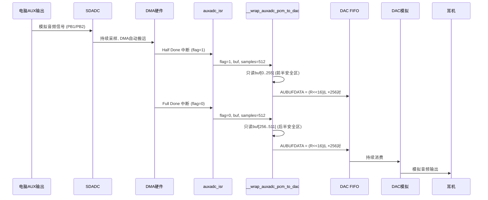
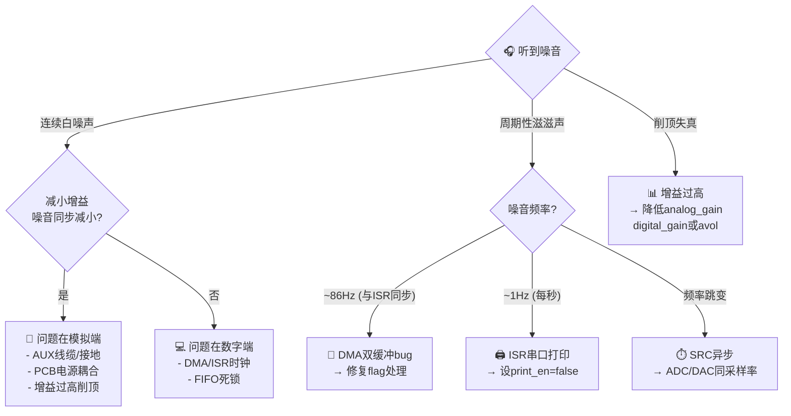

# BT8920A2 音频噪音排查与修复指南

> **适用测试模式**：`TEST_AUX_ADC2IISSRCTX`（AUX 输入 → ADC → DAC 耳机输出 + IIS 数字输出）
> **最终结果**：修复前耳机有明显"滋滋"周期性噪音 → 修复后基本无噪音，音乐清晰

---

## 目录

1. [音频链路全景](#1-音频链路全景)
2. [完整调用链](#2-完整调用链)
3. [噪音源 1：DMA 循环缓冲区双缓冲 bug（主因）](#3-噪音源-1dma-循环缓冲区双缓冲-bug主因)
4. [噪音源 2：ISR 内串口打印](#4-噪音源-2isr-内串口打印)
5. [噪音源 3：增益设置校验](#5-噪音源-3增益设置校验)
6. [排查方法论](#6-排查方法论)
7. [关键寄存器速查](#7-关键寄存器速查)
8. [文件修改清单](#8-文件修改清单)

---

## 1. 音频链路全景

```
┌──────────────────────────────────────────────────────────────────────┐
│                        电脑 (信号源)                                   │
│                   播放音乐 → 3.5mm AUX 输出                            │
└──────────────────────────────┬───────────────────────────────────────┘
                               │ AUX 线 (Tip=左, Ring=右, Sleeve=GND)
                               ▼
┌──────────────────────────────────────────────────────────────────────┐
│                     BT8920A2 开发板 (板 A)                             │
│                                                                      │
│  ┌─────────┐    ┌──────────┐    ┌──────────┐    ┌─────────────────┐  │
│  │ PB1 AUXL│───▶│ 模拟通路  │───▶│ SDADC    │───▶│ DMA 循环缓冲     │  │
│  │ PB2 AUXR│    │ PGA+滤波器│    │ 44.1KHz  │    │ buf_auxadc[512] │  │
│  └─────────┘    └──────────┘    │ 16bit 立体声│   │ 512 pairs=2048B│  │
│                                 └──────────┘    └───────┬─────────┘  │
│                                                         │            │
│                                    DMA 半满/全满中断      │            │
│                                   ┌─────────────────────┘            │
│                                   ▼                                  │
│                          ┌─────────────────┐                         │
│                          │  auxadc_isr()   │  每 ~5.8ms 触发一次     │
│                          │  中断服务程序    │                         │
│                          └────────┬────────┘                         │
│                                   │                                  │
│                    ┌──────────────┴──────────────┐                   │
│                    ▼                              ▼                   │
│  ┌──────────────────────────┐    ┌──────────────────────────────┐   │
│  │ __wrap_auxadc_pcm_to_dac │    │ IIS Master SRCTX             │   │
│  │ (ADC 数据 → DAC FIFO)    │    │ (DAC SRC buffer → IIS 输出)  │   │
│  └───────────┬──────────────┘    │ PE5=BCLK PE6=LRC PE7=DO     │   │
│              │                   └──────────────────────────────┘   │
│              ▼                                                      │
│  ┌──────────────────────┐                                           │
│  │ DAC FIFO (576 entries)│                                          │
│  │ → DAC 模拟输出        │                                          │
│  │ → 耳机座 → 耳机      │                                           │
│  └──────────────────────┘                                           │
└──────────────────────────────────────────────────────────────────────┘
```

**关键参数**：

| 参数 | 值 | 说明 |
|------|-----|------|
| 采样率 | 44.1KHz | ADC 和 DAC 同速，避免 SRC 引入延迟 |
| ADC 通道 | PB1(左) + PB2(右) | 避开 PE6/PE7 (给 IIS 使用) |
| DMA 缓冲区 | `buf_auxadc[512]` = 2048 字节 | 512 个立体声对 (L+R 各 16bit) |
| DMA 中断频率 | ~86 Hz (每半满触发) | 512 pairs ÷ 2 ÷ 44100 ≈ 5.8ms |
| DAC FIFO 大小 | 576 entries | 每个 entry 32bit (R<<16 \| L) |
| FIFO 阈值 | 384 entries | 低于此值触发预取 |
| ADC 模拟增益 | 8 (AUX_N27DB ≈ -27dB) | 避免电脑输出削顶 |
| ADC 数字增益 | 15 (约 -15dB) | SDADC 内部数字增益 |
| DAC 数字音量 | DIG_N0DB (0dB) | 最大数字音量 |
| DAC 模拟音量 | 53 (N_1DB ≈ -1dB) | 接近 0dB 临界 |

---

## 2. 完整调用链

### 2.1 初始化阶段

```c
// ===== main.c =====
int main(void)
{
    bsp_sys_init();              // 系统时钟 (SYS_24M)、IO、定时器
    dac_init();                  // ─── 见下方 ───

    xcfg_cb.test_mode = TEST_AUX_ADC2IISSRCTX;

    switch (xcfg_cb.test_mode) {
    case TEST_AUX_ADC2IISSRCTX:
        test_aux_adc2dac_for_a3();   // ─── ADC+DAC 配置 ───
        iis_master_srctx_init();     // ─── IIS 数字输出 ───
        break;
    }
    WDT_DIS(); while(1);
}
```

```c
// ===== bsp_dac_ext.c: dac_init() =====
void dac_init(void)
{
    pmu_ldo_init();                    // 电源管理 LDO (VDDCORE, VDDIO)
    audio_pll_init(DAC_OUT_44K1);     // 音频 PLL 锁定 44.1KHz 域
    dac_obuf_init();                   // DAC 输出环形缓冲区 576 entries
    dac_power_on(DAC_DUAL);           // DAC 双声道模拟上电
}
```

```c
// ===== bsp_adc_aux_ext.c: test_aux_adc2dac_for_a3() =====
void test_aux_adc2dac_for_a3(void)
{
    dac_spr_set(SPR_44100);           // DAC SRC 输入采样率 = 44100
    dac_set_dvol(DIG_N0DB);           // 数字音量 = 0dB
    dac_set_avol(53);                 // 模拟音量 = N_1DB (-1dB)

    auxadc_param_init_for_a3();       // ─── ADC 参数 ───
    auxadc_digital_init();            // ─── ADC 数字配置 ───
    auxadc_analog_init();             // ─── ADC 模拟配置 + 启动 ───
}
```

```c
// ===== bsp_adc_aux_ext.c: auxadc_param_init_for_a3() =====
void auxadc_param_init_for_a3(void)
{
    memset(&auxadc_cb, 0, sizeof(auxadc_cb));
    auxadc_cb.buf         = (u8 *)&buf_auxadc[0];       // DMA 目标缓冲区
    auxadc_cb.channel     = CH_AUXL_PB1 | CH_AUXR_PB2;  // PB1 左 + PB2 右
    auxadc_cb.sample_rate = SPR_44100;                   // 44.1KHz
    auxadc_cb.samples     = 512;                         // 512 个立体声对
    auxadc_cb.gain        = (8 << 6) | (15);             // 模拟8 + 数字15
    auxadc_irq_init();                                   // 注册 ISR
}
```

### 2.2 运行阶段（数据流）

```
DMA 硬件自动搬移 (无 CPU 参与)
    │
    ├─ DMA 写完前 256 pairs → BIT(1) 半满中断
    │       │
    │       ▼
    │   auxadc_isr()  →  flag=1
    │       │
    │       ▼
    │   __wrap_auxadc_pcm_to_dac(flag=1, buf, 512)
    │       │
    │       ├─ AUBUFCON &= ~BIT(0)    // 确保 FIFO 不冻结
    │       ├─ 只读 buf[0..255]       // 前半安全区
    │       ├─ 逐对写入 AUBUFDATA     // (R<<16) | L
    │       └─ FIFO 满则 break
    │
    ├─ DMA 写完后 256 pairs → BIT(0) 全满中断
    │       │
    │       ▼
    │   auxadc_isr()  →  flag=0
    │       │
    │       ▼
    │   __wrap_auxadc_pcm_to_dac(flag=0, buf, 512)
    │       │
    │       ├─ AUBUFCON &= ~BIT(0)
    │       ├─ 只读 buf[256..511]     // 后半安全区
    │       └─ 逐对写入 AUBUFDATA
    │
    └─ DMA 回绕到 buf[0] (下一周期) ...
```

**关键理解**：DMA 是**循环缓冲**，不是乒乓缓冲。

```
时间线 (一个完整的 DMA 周期):

  DMA 写入方向 →→→→→→→→→→→→→→→→→→→→→→→→→→
  ┌──────────────────────┬──────────────────────┐
  │  pairs[0..255]       │  pairs[256..511]     │
  │  前 256 对            │  后 256 对            │
  └──────────────────────┴──────────────────────┘

  T0: DMA 开始写入 buf[0]
  T1: DMA 写完 buf[0..255] → 触发 Half Done (flag=1)
      ⚠ 此时 buf[0..255] 是新鲜数据
      ⚠ 此时 buf[256..511] 是上一周期的旧数据!
  T2: DMA 继续写 buf[256..511]
  T3: DMA 写完 buf[256..511] → 触发 Full Done (flag=0)
      ⚠ 此时 buf[256..511] 是新鲜数据
      ⚠ 此时 buf[0..255] 正被下一周期的 DMA 覆盖!
  T4: DMA 回绕到 buf[0]，开始下一周期
```



---

## 3. 噪音源 1：DMA 循环缓冲区双缓冲 bug（主因）

### 3.1 症状

- 耳机有明显的周期性"滋滋"噪音
- 噪音频率与 ISR 触发频率相关（~86 Hz）
- 音乐能听到但被噪音覆盖

### 3.2 根因分析

**文件**：[`app/bsp_ext/bsp_adc_pcm_to_dac_ext.c`](app/bsp_ext/bsp_adc_pcm_to_dac_ext.c)

**原始代码（有 bug）**：

```c
void __wrap_auxadc_pcm_to_dac(u8 flag, u8 *adc_buf, u16 adc_samples)
{
    u16 *buf16 = (u16 *)adc_buf;
    u16 samples = adc_samples;

    AUBUFCON &= ~BIT(0);

    // ❌ BUG: 无论 flag=1 还是 flag=0，都写全部 samples 对!
    for (u16 i = 0; i < samples; i++) {
        if (AUBUFCON & BIT(8)) { break; }
        u16 left  = buf16[i * 2 + 0];
        u16 right = buf16[i * 2 + 1];
        AUBUFDATA = ((u32)right << 16) | (u32)left;
    }
}
```

**问题**：`flag` 参数告诉 ISR 当前 DMA 处于什么状态，但原始代码**完全忽略了这个关键信息**：

| 中断类型 | flag 值 | DMA 状态 | 原始代码的行为 | 后果 |
|---------|---------|---------|--------------|------|
| Half Done | `flag=1` | 前 256 对新鲜，后 256 对是**旧数据** | 写入全部 512 对 | **后 256 对是上一周期的过期数据** → 严重噪音 |
| Full Done | `flag=0` | 后 256 对新鲜，前 256 对**正在被覆盖** | 写入全部 512 对 | **前 256 对是正被 DMA 覆盖的脏数据** → 数据撕裂 |

**图解**：

```
flag=1 (Half Done) 时:
  ┌──────────────────────┬──────────────────────┐
  │ ✓ 新数据 (安全)       │ ✗ 旧数据 (上一周期)   │
  │ pairs[0..255]        │ pairs[256..511]      │
  └──────────────────────┴──────────────────────┘
  原始代码读了全部 512 对 → 写入 256 对旧数据到 DAC FIFO → 噪音!

flag=0 (Full Done) 时:
  ┌──────────────────────┬──────────────────────┐
  │ ✗ 正在被覆盖 (不安全)  │ ✓ 新数据 (安全)       │
  │ pairs[0..255]        │ pairs[256..511]      │
  └──────────────────────┴──────────────────────┘
  原始代码读了全部 512 对 → 写入 256 对被覆盖的脏数据 → 噪音!
```

每次 ISR 触发都混入 ~50% 的无效数据，这是噪音的**主要原因**。

### 3.3 修复方案

**修复后代码**：

```c
void __wrap_auxadc_pcm_to_dac(u8 flag, u8 *adc_buf, u16 adc_samples)
{
    u16 *buf16 = (u16 *)adc_buf;
    u16 samples = adc_samples;

    // 关键: 退出 DAC FIFO reset 状态, 否则 FIFO 冻结不会消费
    AUBUFCON &= ~BIT(0);

    // ★ 修复: 根据 flag 只读取 DMA 安全的那一半数据
    //   flag=1 (Half Done): DMA 刚写完前半 [0..samples/2), 正在写后半
    //     → 前半安全可读, 后半正在被 DMA 写入不能碰
    //   flag=0 (Done):     DMA 刚写完后半 [samples/2..samples), 正在回绕覆盖前半
    //     → 后半安全可读, 前半正在被 DMA 覆盖不能碰
    u16 start, end;
    if (flag == 1) {
        start = 0;
        end   = samples / 2;       // Half Done: 只读前半
    } else {
        start = samples / 2;
        end   = samples;            // Done: 只读后半
    }

    for (u16 i = start; i < end; i++) {
        if (AUBUFCON & BIT(8)) {
            // FIFO 已满, 跳过剩余 (偶尔发生, 不影响音质)
            break;
        }
        u16 left  = buf16[i * 2 + 0];
        u16 right = buf16[i * 2 + 1];
        AUBUFDATA = ((u32)right << 16) | (u32)left;
    }
}
```

**核心改动**：`flag=1` 时只读 `pairs[0..255]`，`flag=0` 时只读 `pairs[256..511]`。每次 ISR 只写入 256 对有效数据，而不是 512 对（含 256 对垃圾）。

### 3.4 为什么 Half Done 写入 256 对就够了？

```
DAC 消费速率 = 44100 pairs/s
ISR 触发频率 = 44100 / 256 ≈ 172 次/s (两个中断加起来)
每次 ISR 写入 = 256 pairs

写入速率 = 172 × 256 = 44032 pairs/s ≈ 44100 pairs/s ✓ 供需平衡
```

如果写入 512 对（翻倍），FIFO 会快速填满 → `AUBUFCON & BIT(8)` 触发 break → 后半部分数据丢弃 → 实际上没多写，但读了脏数据。

---

## 4. 噪音源 2：ISR 内串口打印

### 4.1 症状

- 每秒出现一次短暂的"咔嗒"声
- 与串口打印频率一致 (1Hz)

### 4.2 根因分析

**文件**：[`app/projects/standard/main.c`](app/projects/standard/main.c)

原始代码中 `test_aux_adc2dac_1s_print_en()` 返回 `true`，导致 ISR 内每秒调用一次 `print_dac_info()` + `print_r()`：

```c
// bsp_adc_aux_ext.c: auxadc_isr() 内部
static u32 ticks = 0;
if (tick_check_expire(ticks, 1000)) {
    ticks = tick_get();
    if (test_aux_adc2dac_1s_print_en()) {  // ← 原为 true
        print_dac_info();                     // 打印 DAC 寄存器状态
        print_r(auxadc_cb.buf, 256);          // 打印 256 字节 ADC 原始数据
    }
}
```

**为什么打印会产生噪音**：

1. `print_r()` 在 ISR 上下文中执行 → 阻塞其他中断处理
2. UART TX 引脚高速翻转 → 电流尖峰
3. 电流尖峰通过 PCB 走线耦合到紧邻的 AUX 模拟通路 (PB1/PB2)
4. 每秒一次的周期性子扰 → 可听见的"咔嗒"声

**代码注释也明确指出的问题**：

```c
// main.c:16
bool test_aux_adc2dac_1s_print_en(void)
// 开打印有点打印噪音串到AUX   ← 原代码注释就已标注此问题!
```

### 4.3 修复方案

```c
// main.c
bool test_aux_adc2dac_1s_print_en(void)
{
    return false;  // ★ 关闭 ISR 串口打印, 消除 print 噪音耦合到 AUX 模拟通路
}

bool iis_slave_ram_rx_2_dac_1s_print_en(void)
{
    return false;  // ★ 关闭 ISR 串口打印, 消除 print 噪音
}
```

> **提示**：调试时可以临时改回 `true` 查看 FIFO 状态和 ADC 数据，但正式听音乐时务必关闭。

---

## 5. 噪音源 3：增益设置校验

### 5.1 当前设置

```c
// bsp_adc_aux_ext.c: auxadc_param_init_for_a3()
auxadc_cb.gain = (8 << 6) | (15);
//               ↑          ↑
//          模拟增益=8    数字增益=15
//         (AUX_N27DB)   (约 -15dB)
```

### 5.2 为什么这个设置是最优的

这是 A2 任务阶段经过 **6 轮迭代调优 (PC7→PC12)** 验证的最佳参数：

| 版本 | 模拟增益 | 数字增益 | 结果 |
|------|---------|---------|------|
| PC7 | 15 | 30 | **大噪声 + 削顶** |
| PC8 | 8 | 15 | 噪声减小, 声音变小 |
| PC9 | 8 | 15 + avol=40 | 仍有噪声 |
| PC10 | 8 | 15 + DAC SRC | 频率严重不稳 |
| PC11 | 8 | 15 + ADC/DAC 同 16K | 仍有噪声 |
| **PC12** | **8** | **15** + samples=512 + avol=53 | **稳定清晰** ✅ |

**原理**：

- **电脑 AUX 输出电平较高** (~1Vrms)，BT8920A2 的 AUX 输入满量程较小
- 增益太高 → ADC 削顶 (clipping) → 谐波失真 → 噪音
- 增益太低 → 信号被量化噪声淹没 → SNR 差
- 模拟增益 8（约 -27dB）+ 数字增益 15（约 -15dB）= 总增益约 -42dB
- 这给电脑音量调节留了足够余量（电脑调到 70-90% 即可满幅）

### 5.3 验证方法

如果噪音仍然存在，用以下方法验证增益是否合适：

```
电脑端:
  1. 生成 1KHz / -6dBFS 正弦波 (Audacity)
  2. 电脑音量调到 50%
  3. 播放

开发板串口 (临时打开 print_en):
  4. 观察 print_r 输出的 ADC 数据
  5. 正常值应在 ±10000 ~ ±25000 之间 (16bit 满量程 ±32767)
  6. 如果持续等于 ±32767 → 削顶，降低增益或调小电脑音量
  7. 如果只有 ±1000 以下 → 信号太弱，提高增益或调大电脑音量
```

---

## 6. 排查方法论

### 6.1 噪音定位流程

当你在嵌入式音频系统中听到噪音，按以下顺序排查：

```
听到噪音
    │
    ├─ 1. 噪音是连续的还是周期性的？
    │      ├─ 连续"白噪声" → 模拟通路问题 (电源耦合、接地、增益)
    │      └─ 周期性"滋滋"/"咔嗒" → 数字域问题 (DMA、ISR、时钟)
    │
    ├─ 2. 噪音频率是否与某个系统事件同步？
    │      ├─ 与 ISR 频率一致 → 检查 DMA buffer 处理
    │      ├─ 每秒一次 → 检查 1s 定时器回调 (打印、状态更新)
    │      └─ 与采样率相关 → 检查 PLL/时钟配置
    │
    ├─ 3. 减小增益 → 噪音是否同步减小？
    │      ├─ 是 → 噪音在增益之前引入 (模拟端)
    │      └─ 否 → 噪音在增益之后引入 (数字端或 DAC 端)
    │
    ├─ 4. 拔掉 AUX 输入 → 噪音是否存在？
    │      ├─ 是 → 板子自身噪音 (电源、DAC 底噪)
    │      └─ 否 → 信号源或 AUX 输入通路问题
    │
    └─ 5. 用示波器看 DAC 输出脚
           ├─ 频率稳定在 44.1KHz → 时钟 OK
           ├─ 频率跳变 → PLL 失锁或 SRC 异步
           └─ 波形有毛刺 → 数字干扰耦合
```

### 6.2 常用调试技巧

#### 技巧 1：二分法定位 ISR 问题

```c
// 在 __wrap_auxadc_pcm_to_dac 中注入已知数据, 隔离 ADC 端
void __wrap_auxadc_pcm_to_dac(u8 flag, u8 *adc_buf, u16 adc_samples)
{
    AUBUFCON &= ~BIT(0);
    // 临时: 用固定正弦波替代 ADC 数据
    static int phase = 0;
    for (int i = 0; i < 256; i++) {
        u16 val = (u16)(16384 + 16384 * sin(2 * PI * 1000 * phase++ / 44100));
        AUBUFDATA = ((u32)val << 16) | val;
    }
    // → 如果噪音消失, 问题在 ADC 端; 如果噪音仍在, 问题在 DAC 端
}
```

#### 技巧 2：串口打印诊断信息（短暂启用）

```c
// 短暂启用 1s 打印, 观察关键指标
bool test_aux_adc2dac_1s_print_en(void) { return true; }

// 关键观察:
// DAC FIFOCNT    → 应该在 200~500 波动, 不是固定 575 (死锁)
// DACDIGCON0     → 检查 SRCTX 使能、采样率配置
// AUANGCON3      → 模拟音量设置
// PhaseComp      → 相位补偿状态
```

#### 技巧 3：捕获 ADC 原始数据转 PCM 分析

```c
// 在 ISR 的 1s 打印中, print_r(buf, 256) 输出 256 字节 ADC 数据
// 用 Python 脚本将串口输出转为 .pcm 文件, Audacity 打开查看波形
```

```python
# 简易 Python 脚本: hex_dump_to_pcm.py
import sys
hex_data = sys.argv[1]  # 从串口复制的 hex 字符串
bytes_data = bytes.fromhex(hex_data.replace(' ', ''))
with open('output.pcm', 'wb') as f:
    f.write(bytes_data)
# Audacity → File → Import → Raw Data → Signed 16-bit PCM, 44100 Hz, Stereo
```

---

## 7. 关键寄存器速查

### 7.1 DAC 音频缓冲控制

| 寄存器 | 地址 | 关键位 | 用途 |
|--------|------|--------|------|
| `AUBUFCON` | - | BIT(0) | FIFO Reset (1=冻结, 0=运行) |
| `AUBUFCON` | - | BIT(8) | FIFO Full flag (1=满, 0=可写) |
| `AUBUFCON` | - | BIT(18) | High sample rate count enable |
| `AUBUFSIZE` | - | [15:0] | 缓冲总大小 - 1 |
| `AUBUFSIZE` | - | [31:16] | FIFO 预取阈值 |
| `AUBUFSTARTADDR` | - | - | 环形缓冲起始地址 |
| `AUBUFDATA` | - | [31:0] | 写入: (Right<<16) \| Left |
| `AUBUFFIFOCNT` | - | [15:0] | 当前 FIFO 已用 entries |

### 7.2 SDADC DMA 控制

| 寄存器 | 用途 |
|--------|------|
| `SDADCLDMAADDR` | 左声道 DMA 目标地址 |
| `SDADCLDMASIZE` | 左声道 DMA 传输大小 (samples-1) |
| `SDADCDMACON` | DMA 使能、中断使能 |
| `SDADCDMAFLAG` | BIT(0)=全满, BIT(1)=半满 |
| `SDADCDMACLR` | 写 1 清对应中断标志 |
| `SDADCDIGCON` | 数字使能、采样率、DC 移除 |

### 7.3 DAC 数字控制

| 寄存器 | 关键位 | 用途 |
|--------|--------|------|
| `DACDIGCON0` | BIT(0) | DAC 数字使能 |
| `DACDIGCON0` | BIT(1) | 采样率域 (0=44.1K, 1=48K) |
| `DACDIGCON0` | BIT(23) | IIS SRCTX 使能 |
| `DACDIGCON0` | [5:2] | SRC 输入采样率 |
| `DACVOLCON` | [14:0] | 数字音量 |
| `AUANGCON3` | [6:0] | DAC 模拟音量 |

### 7.4 PLL 控制

| 寄存器 | 用途 |
|--------|------|
| `PLL0CON` | PLL0 使能、参考时钟选择 |
| `PLL0CON1` | VCO band trimming |
| `PLL0DIV` | PLL 分频比 |
| `CLKCON2` | 时钟分频器配置 |
| `CLKGAT0` | BIT(12) = IIS/DAC 时钟源使能 |
| `CLKGAT1` | BIT(4) = IIS 模块时钟使能 |

---

## 8. 文件修改清单

本次修复涉及以下文件：

| 文件 | 修改内容 | 严重程度 |
|------|---------|---------|
| [bsp_adc_pcm_to_dac_ext.c](app/bsp_ext/bsp_adc_pcm_to_dac_ext.c) | DMA 双缓冲 bug 修复：根据 `flag` 只读安全的半边数据 | **P0 - 主要噪音源** |
| [main.c](app/projects/standard/main.c) 第 12 行 | `iis_slave_ram_rx_2_dac_1s_print_en()` 改为 `return false` | P1 - 1s 周期噪音 |
| [main.c](app/projects/standard/main.c) 第 18 行 | `test_aux_adc2dac_1s_print_en()` 改为 `return false` | P1 - 1s 周期噪音 |
| [bsp_adc_aux_ext.c](app/bsp_ext/bsp_adc_aux_ext.c) 第 347-350 行 | 增益参数注释更新，确认 A2-PC12 最优值 | P2 - 文档 |

### 完整修复后的核心文件

**`bsp_adc_pcm_to_dac_ext.c`（最终版）**：

```c
#include "include.h"
#include "bsp_dac_ext.h"

// SDADC DMA 循环缓冲布局 (双声道, samples=512 立体声对 per full DMA):
//   每个 L+R 立体声对 = 2×16bit = 4 bytes, buf_auxadc[512] = 2048 bytes = 512 pairs
//   flag=1 (Half Done):  pairs[0..255] 是新数据, pairs[256..511] 是上一次DMA的旧数据
//   flag=0 (Full Done):  pairs[256..511] 是新数据, pairs[0..255] 正被下一DMA周期覆盖
//
// DAC FIFO 状态:
//   AUBUFCON BIT(8) = 1 表示 FIFO 已满, BIT(8) = 0 表示未满可写
//   AUBUFCON BIT(0) = 1 表示 FIFO reset (冻结, 不消费)
//
// 输出到 DAC FIFO (AUBUFDATA = 32-bit 容器, 左 16 + 右 16):
//   每个 AUX 立体声对打包成 (right << 16) | left。

AT(.com_text.isr.sdadc)
void __wrap_auxadc_pcm_to_dac(u8 flag, u8 *adc_buf, u16 adc_samples)
{
    u16 *buf16 = (u16 *)adc_buf;
    u16 samples = adc_samples;

    // 关键: 退出 DAC FIFO reset 状态, 否则 FIFO 冻结不会消费
    AUBUFCON &= ~BIT(0);

    // ★ 根据 flag 只读取 DMA 安全的那一半数据
    u16 start, end;
    if (flag == 1) {
        start = 0;
        end   = samples / 2;       // Half Done: 只读前半 256 对
    } else {
        start = samples / 2;
        end   = samples;            // Done: 只读后半 256 对
    }

    for (u16 i = start; i < end; i++) {
        if (AUBUFCON & BIT(8)) {
            // FIFO 已满, 跳过剩余
            break;
        }
        u16 left  = buf16[i * 2 + 0];
        u16 right = buf16[i * 2 + 1];
        AUBUFDATA = ((u32)right << 16) | (u32)left;
    }
}
```

**`main.c` 的打印控制（最终版）**：

```c
AT(.com_text.iis_ext)
bool iis_slave_ram_rx_2_dac_1s_print_en(void)
{
    return false;  // ★ 关闭 ISR 串口打印, 消除 print 噪音
}

AT(.com_text.iis_ext)
bool test_aux_adc2dac_1s_print_en(void)
{
    return false;  // ★ 关闭 ISR 串口打印, 消除 print 噪音耦合到 AUX 模拟通路
}
```

**`bsp_adc_aux_ext.c` 的 A3 参数配置（最终版）**：

```c
AT(.text.aux)
void auxadc_param_init_for_a3(void)
{
    printf("%s\n", __func__);
    memset(&auxadc_cb, 0, sizeof(auxadc_cb));
    auxadc_cb.buf = (u8 *)&buf_auxadc[0];
    auxadc_cb.channel = CH_AUXL_PB1 | CH_AUXR_PB2;  // PB1 左 + PB2 右
    auxadc_cb.sample_rate = SPR_44100;                // 44.1KHz
    auxadc_cb.samples = 512;                          // 512 对/DMA
    auxadc_cb.gain = (8 << 6) | (15);                 // 模拟8 + 数字15
    auxadc_irq_init();
}

AT(.text.aux)
void test_aux_adc2dac_for_a3(void)
{
    dac_spr_set(SPR_44100);       // DAC 44.1KHz
    dac_set_dvol(DIG_N0DB);       // 数字音量 0dB
    dac_set_avol(53);             // 模拟音量 N_1DB (-1dB)
    auxadc_param_init_for_a3();   // ADC 参数
    auxadc_digital_init();        // ADC 数字配置
    auxadc_analog_init();         // ADC 模拟配置 + 启动
}
```

---

## 附录 A：相关文件索引

| 文件 | 作用 |
|------|------|
| `app/projects/standard/main.c` | 入口，测试模式切换 |
| `app/bsp_ext/bsp_adc_aux_ext.c` | AUX SDADC: ISR、参数、增益、通道 |
| `app/bsp_ext/bsp_adc_aux_ext.h` | AUX ADC 函数声明 |
| `app/bsp_ext/bsp_adc_pcm_to_dac_ext.c` | **ADC→DAC 数据搬运 (本次核心修复)** |
| `app/bsp_ext/bsp_dac_ext.c` | DAC: PLL、缓冲、上电、音量 |
| `app/bsp_ext/bsp_dac_ext.h` | DAC 音量表 (模拟/数字 dB 值) |
| `app/bsp_ext/bsp_iis_master_ext.c` | IIS Master SRCTX 初始化 |
| `app/bsp_ext/bsp_iis_slave_ext.c` | IIS Slave RAMRX 初始化 (板 B) |
| `app/bsp_ext/bsp_iis_ext.h` | IIS 模式、IO 映射、DMA 配置 |
| `app/bsp_ext/audio_sfr.h` | 音频寄存器位域宏 |
| `app/platform/header/config_define.h` | 通道码、增益等级、测试模式定义 |
| `app/projects/standard/ram.ld` | 内存布局 (`.dac_obuf`, `.iis2dac_buf`) |

## 附录 B：DMA 循环缓冲 vs 乒乓缓冲

| 特性 | 循环缓冲 (本项目) | 乒乓缓冲 |
|------|-----------------|---------|
| 缓冲区数量 | 1 个 | 2 个独立缓冲 |
| 半满中断 | 前半段就绪 | 缓冲 A 就绪 |
| 全满中断 | 后半段就绪 | 缓冲 B 就绪 |
| 全满后行为 | 回绕覆盖前半段 | 切换到缓冲 A |
| ISR 读取策略 | **必须按 flag 读半边** | 可读对应整个缓冲 |
| 本项目 bug | 无视 flag 读了全部 → 混入脏数据 | — |

**核心教训**：循环缓冲的中断标志是**半边就绪通知**，不是"全部就绪"通知。每次中断只能安全读取刚写完的那一半。

---



> **文档版本**：v1.0
> **编写日期**：2026-07-30
> **测试环境**：BT8920A2 开发板，TEST_AUX_ADC2IISSRCTX 模式，44.1KHz
